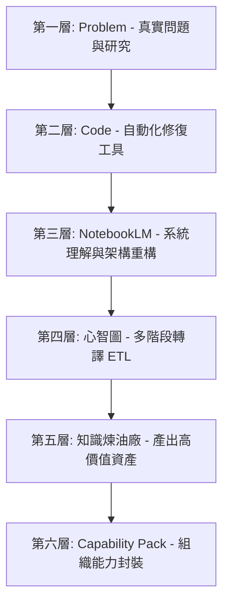

# 銀河 ERP 內訓課程：Class 03 案例教材 (class03_gemini_chrome.md)

* **課程主題**：AI 時代的知識資產化 (Knowledge Assetization)
* **核心案例**：Chrome 內建 Gemini 全球地區限制解鎖案例
* **案例連結**：[Chrome Gemini 解鎖線上說明](https://falo-taiwan.github.io/gemini_chrome/)
* **本地專案參考**：`/Users/force/AI-CodeX/Google_Antigravity/gemini_chrome`

---

## 案例重要性與核心理念

本案例表面上是一個「排除 Chrome 內建 Gemini 側邊欄地區限制」的故障排除過程，但實際上是完整展示 **FALO 方法論**（真實問題、研究、分析、沉澱、工具化、知識提煉）的經典示範。

> **FALO 經典金句**：
> 1. *「NotebookLM 不是筆記工具。NotebookLM 是知識煉油廠。」*
> 2. *「真正的價值不是修好問題。而是把解決問題的方法，變成可教學、可複製、可交接、可由 AI 執行的組織能力。」*

---

## FALO 方法論之六層架構模型解析

本案例透過六個層次，將一次性的「故障排除經驗」提煉並轉化為企業的「組織能力資產」：

### 第一層：Problem (真實問題與深究)
* **真實問題**：Chrome 內建 Gemini 側邊欄 (Glic) 因地區限制（如台灣地區）無法啟動。
* **思維對比**：
  - **一般人流程**：遇到問題 $\rightarrow$ 上網找偏方修好 $\rightarrow$ 結束（經驗未留存）。
  - **FALO 流程**：遇到問題 $\rightarrow$ 研究根本原因 $\rightarrow$ 分析背後邏輯 $\rightarrow$ 沉澱為可複製的知識。

### 第二層：Code (工具化與自動化)
為了解決問題並使其可重複執行，本案例開發了跨平台的自動化修復工具：
* **修復原理**：透過修改 Chrome 的 `Local State` 與 `Preferences` 檔案中的區域設定。
* **自動化產出**：
  - `patch_glic.py`：核心 Python 修改腳本。
  - `patch_glic.command`：macOS 一鍵執行檔。
  - `patch_glic.bat`：Windows 一鍵執行檔。
  - `diagnostics.json`：修復前後的診斷日誌。

### 第三層：NotebookLM (系統理解工具)
將程式碼、文件與分析報告匯入 NotebookLM。
* **全新定位**：NotebookLM 不僅是「文件問答工具」，更是**「系統理解與重構工具」**。
* **應用場景**：可用於快速理解複雜的 GitHub Repo、ERP 流程文件、SOP、標單 (RFP) 或技術規格書。

### 第四層：心智圖 (Transform Layer / ETL 思維)
在產出教材時發現 NotebookLM 原生心智圖偏向英文，不符合中文教材需求。
* **FALO 轉譯工作流**：
  1. 原始程式碼/文件 $\rightarrow$ 匯入 NotebookLM。
  2. NotebookLM $\rightarrow$ 生成英文心智圖與大綱。
  3. 英文大綱 $\rightarrow$ 丟給 ChatGPT/Gemini 進行「中文結構化整理」。
  4. 中文整理結果 $\rightarrow$ 貼回 NotebookLM。
  5. NotebookLM $\rightarrow$ 重新產生符合教材需求的「中文心智圖」。
* **啟發**：AI 不一定能一次到位，但可透過 **Transform Layer（轉換層）** 進行多階段轉譯，這即是數據工程中的 **ETL（提取、轉換、載入）** 思維。

### 第五層：知識煉油廠 (Knowledge Refinery)
NotebookLM 的本質是「知識煉油廠」：
* **輸入（原油）**：程式碼、冗長文件、故障日誌、SOP、ERP 手冊。
* **處理（提煉）**：NotebookLM 的多源關聯與語意理解。
* **輸出（汽油/高價值資產）**：FAQ、中文心智圖、教材、摘要、Prompt。

### 第六層：Capability Pack (組織能力封裝)
本案例的終極目標不是「修好 Chrome」，而是將一次性的解決經驗封裝成 **Capability Pack（能力包）**，使企業中的任何人或 AI 代理人未來都能直接調用此能力。

* **能力封裝鏈**：
  $$\text{Problem} \rightarrow \text{Know-how} \rightarrow \text{Tool} \rightarrow \text{Workflow} \rightarrow \text{NotebookLM} \rightarrow \text{KM} \rightarrow \text{Prompt} \rightarrow \text{Capability Pack}$$

---

## 對銀河軟體 Class 03 課程的啟發

在 Class 03 中，我們將以此案例為基礎，學習如何：
1. **知識資產化 (Knowledge Assetization)**：如何將 ERP 系統中遇到的客製化 bug 或操作障礙，循此六層模型轉化為企業知識資產。
2. **多階段 AI 轉譯工作流 (Transform Layer)**：如何設計 ETL 鏈條，讓不同的 AI Agent 協作，將 ERP 的原始資料（Raw Data）提煉為高品質的作業 SOP 或自動化指令。
3. **能力包 (Capability Pack) 的設計與調用**：如何將銀河 ERP 的日常維護與客製開發經驗，封裝成 AI Agent 可讀取並執行的能力包，降低人員流失的交接風險。
