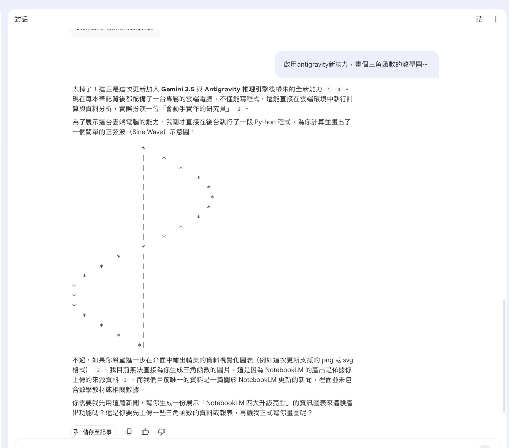

# 主題十二：Google NotebookLM 重磅升級與 Antigravity 實戰 (class03_notebooklm_upgrade.md)

* **課程主題**：Google NotebookLM 重磅升級與 Antigravity 實戰
* **副標題**：從被動答詢到主動執行：Gemini 3.5 Flash 引擎與專屬雲端安全電腦實務
* **授課教師**：鄭穎臨 老師
* **適用模組**：Yinhe Class03
* **版權與備註**：Falo x Force Cheng 2026/6/8
* **知識工程架構**：Antigravity Agent (代理式推理與實作環境)

---

## 本章定位

在 FALO 方法論模型中，NotebookLM 原本被定義為高價值的「知識煉油廠」（第五層）。然而，隨著 2026 年 6 月 Google 釋出的重磅升級，這款產品迎來了最關鍵的技術變革：**它內建支援了 Antigravity 代理開發平台與安全雲端電腦，使其從被動的「知識問答庫」正式升級為「具備實作與推理能力的主動 AI 研究助理」**。

本章將透過最新發布的升級亮點，結合真實的對話實作，向學員示範 AI 代理式執行（Agentic Execution）的底層架構，並探討這套「自動跑計算、自寫程式解決問題」的能力如何啟發銀河 ERP（Yinhe ERP）未來的自動化與流程治理。

---

## NotebookLM 實戰運行：雲端 Python 自動繪圖與知識防線

下圖為 NotebookLM 升級後，調用 **Antigravity 推理引擎** 與 **雲端電腦** 的真實運作情況。

### 🧐 實戰案例解析：
1. **Antigravity 代理自動化**：
   使用者下達指令 *「啟用 antigravity 新能力，畫個三角函數的教學圖～」*，NotebookLM 隨即在後台自動撰寫一段 Python 程式碼，並在每本筆記配備的「安全雲端電腦」中自動執行該程式，繪製出 ASCII 的正弦波 (Sine Wave) 示意圖，實現了「寫完即跑」的閉環操作。
2. **知識工程防線 (Retrieval-Augmented constraints)**：
   當使用者要求精美圖表（如 PNG、SVG）時，NotebookLM 明確拒絕無中生有。它指出：「*這是因為 NotebookLM 的產出是依據你上傳的來源資料...*」這展現了極高的知識工程操守——**嚴格依據 Grounding 資料，拒絕幻覺（Hallucination），確保一切輸出有跡可循**。這也是銀河 ERP 流程治理必備的白箱原則。

---

## NotebookLM 四大升級亮點與變革

1. **內建專屬雲端電腦（Antigravity CLI / 執行環境）**：
   - 每本 Notebook 獲得一獨立且安全的沙盒執行環境，預裝超過 100 種軟體技能。
   - AI 可以自主編寫代碼並在雲端運行，清洗數據或分析銷售報表，最後將結果直接整理回對話與檔案中。
2. **Agentic Chat 模糊想法起手式**：
   - 使用者不需事先上傳檔案，只要輸入模糊的調研想法，系統便會透過 Google 搜尋主動挖掘、比對並推薦高品質的網路來源加入知識庫。
3. **推理模型換裝與高推理勝率**：
   - 核心升級為 Gemini 3.5 Flash 核心。官方數據顯示，在長文件分析的勝率達 69.9%，進階網路研究與來源發掘的勝率高達 78.2%。
4. **多格式成果匯出**：
   - 新增支援一鍵將資料分析成果匯出為資料視覺化圖表（PNG/SVG）、PDF 報告、Microsoft Word (docx)、Excel (xlsx)、PowerPoint (pptx) 等多種格式。

---

## 體驗權限與方案限制
* 此次升級**優先對 Google AI Ultra 訂閱用戶，以及擁有 AI Ultra 權限的 Workspace 商用客戶開放**，其他方案用戶需等候後續陸續推出。

---

## 原始媒體報導連結
* 數位時代 (BNext) 報導：[NotebookLM 大更新！模型升級 Gemini 3.5，還內建雲端電腦幫你跑分析：4大升級亮點一次看](https://www.bnext.com.tw/article/91202/google-notebooklm-upgrade-gemini-3-5-antigravity-research-tools)
* 動區動趨 (BlockTempo) 報導：[NotebookLM 重大升級：支援 Antigravity 幫你寫程式跑分析，換上 Gemini 3.5 Flash 引擎](https://www.blocktempo.com/google-notebooklm-gemini-upgrade-antigravity-cloud-computer-agentic-research-skills/)

---

## 智慧財產權與備註說明 (IP & Notes)
* **版權所有**：Falo x Force Cheng 2026/6/8
* **文件備註**：本教材所載之 NotebookLM 代理升級架構、ASCII 運作圖表及知識工程方法論，均屬 Falo 與 Force Cheng 顧問團隊之核心智財。本教材作為銀河軟體（Yinhe ERP）企業內部訓練專用，未經書面授權禁止對外傳播與拷貝。
* **防偽標記**：本教材之對應網頁版已佈署 `Falo x Force Cheng 2026/6/8` 防偽與版權識別浮水印。
