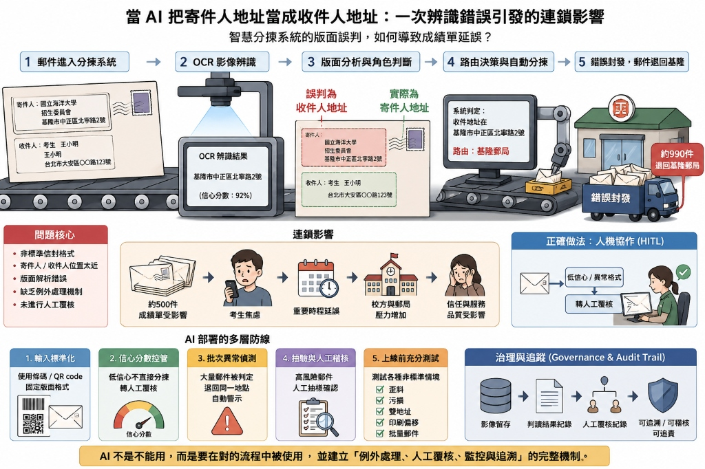

# 主題四：OCR 辨識策略與 HITL 人機協作實務 (class03_ocr_hitl.md)

* **課程模組**：Class 03 實戰與概念
* **核心案例**：某郵政自動化分揀系統致考生成績單延誤投遞事件
* **探討核心**：OCR 辨識邊界、自動化審核 (Audit)、HITL (Human-in-the-Loop) 的必要性

---

## 1. 案例背景與問題分析

* **原始新聞來源**：[自由時報 - 海大甄選成績單延誤 中華郵政出面道歉：調整機器分揀辨識](https://news.ltn.com.tw/news/life/breakingnews/5463575)
* **新聞內文重點摘要**：
  1. **事件起因**：海洋大學於 2026/5/29 委託寄發 1,773 件考生成績單大宗普通掛號郵件，因信封上寄收件人地址皆偏向中間印製，屬於「非標準格式」。
  2. **系統誤判**：該批郵件在台北郵件處理中心（A7 智慧物流園區）進行自動分揀時，機器 OCR 誤將「寄件人地址（海大）」判讀為「收件人」，導致約 990 件郵件被錯誤封發退回基隆（其中約 500 件為成績單），進而造成投遞延誤。
  3. **應變措施**：中華郵政發現後啟動緊急應變、增加投遞頻率，並取得校方諒解、提供資料供考生查詢或親自領取，於 6/5 晚間前全數投遞完畢，未影響考生權益。
  4. **技術檢討**：中華郵政將掛號信件的機器分揀比例從以往的 20% 激進提升至 70%，但忽略了非標準信封的相容性。後續將調整辨識參數，並要求設備廠商增設「非標準書寫排除機制」，遇到此類信件即改為人工分揀或輔助條碼作業。

2026 年 6 月，某郵政智慧物流園區（A7）在處理某海科大交寄的 1773 件普通掛號郵件（考生成績單）時，因**自動化分揀設備的 OCR 誤判**，將「寄件人地址」誤讀為「收件人地址」，導致約 500 件郵件被錯誤封發退回，造成嚴重的投遞延誤與輿論風波。

```
[郵件交寄 (寄/收件地址偏中間)] 
       │
       ▼
[A7 智慧物流園區 OCR 自動分揀] (70% 機器 / 30% 人工)
       │
       ├─(格式非標準/位置誤判) ──> 誤將「寄件人」當作「收件人」
       ▼
[退回原寄件地 (延誤)]
```



### 根本原因剖析：
1. **分揀比例的激進調整**：
   該中心將原本「20% 機器 / 80% 人工」的掛號郵件處理比例，激進地調整為**「70% 機器 / 30% 人工」**。雖然處理量能大幅提升，但卻忽視了機器辨識的侷限性。
2. **機器規則的硬性限制**：
   海科大的信封版面中，寄件人與收件人的地址都印在偏中間的位置。以往採人工分揀時，人類員工能輕易透過上下文判斷；但自動化機器只有嚴格的位置與格式規則，在未設防的情況下直接誤判。
3. **缺乏邏輯校對與例外路由**：
   自動化分揀系統在讀取到地址後，沒有進行基本的邏輯校對（如：收件人地址竟與寄件人地址完全相同，此為邏輯矛盾），亦無設計「低信賴度排除機制」將非標準信件自動路由至人工複核管道。

> [!WARNING]
> **最離譜的痛點：發生在資源最豐富的台北首都門戶**
> 這次的系統性誤判與延誤事件，並非發生在偏遠地區，而是發生在資源最充足、耗資龐大且剛啟用不久的**台北郵件處理中心（台北首都門戶）**。
> 這證明了一個殘酷的技術現實：**再先進的硬體設備、再高昂的預算投資，如果系統缺乏合理的知識工程設計（如邏輯校對 Audit 與 HITL 人機協作審核），在面對真實世界的異常輸入時，依然會發生極為低級的系統癱瘓與業務延誤。**


---

## 2. 知識工程提煉：OCR 辨識與審核策略

此案例為企業在導入 AI 與自動化系統時提供了深刻的教訓。在建構 AI 辨識系統時，必須規劃完整的辨識與審核策略：

### A. OCR 辨識策略 (OCR Recognition Strategy)
* **規格與非標分流**：系統必須清楚定義「標準輸入格式」（如標準信封、標準發票格式）。對於「非標準格式」的輸入，機器必須能自動識別其特徵並標註「低信賴度 (Low Confidence)」。
* **排除與例外機制**：設備廠商應增設「非標準書寫郵件辨識排除機制」。一旦機器無法 100% 確定收寄件人位置，應立即終止自動分揀，改採輔助條碼或人工分揀。

### B. 自動化審核 (Audit / Cross-Validation)
* **雙向檢驗與合理性比對**：機器辨識出的欄位，必須與後台的業務資料庫進行交叉驗證。
  - *例如*：如果 OCR 辨識出來的「收件人郵遞區號」與基隆郵局（寄件地）相同，但目的地卻寫著台北，系統應觸發警告，這就是一種自動化審核 (Audit)。

---

## 3. HITL (Human-in-the-Loop / 人機協作) 的必要性

「人機協作」並不是指人與機器各做各的事，而是**「人類在關鍵決策節點上對 AI 的產出進行審查與把關」**。

| 模式對比 | 完全自動化 (No HITL) | 人機協作 (HITL) |
| :--- | :--- | :--- |
| **處理效能** | 極高（每小時 24,000 件） | 高（機器快速預處理，人僅審查疑難件） |
| **系統糾錯能力** | 無。一旦規則誤判，將產生大規模系統性錯誤。 | **極高**。人類能即時攔截機器的低級錯誤。 |
| **對異常的適應力** | 差。遇到非標準輸入即崩潰或誤判。 | **強**。異常件流向人工，保障整體業務可靠度。 |

---

## 4. 在銀河 ERP 系統中的實務應用

這套 OCR 辨識與 HITL 策略，在 **銀河 ERP** 的自動化模組中至關重要：

### 應用場景一：AI OCR 電子發票/採購單自動核銷
* **風險**：若企業導入 AI 直接讀取供應商發票並自動過帳付款（完全自動化），一旦發票上的備註欄或廣告字眼被 AI 誤判為金額或統編，將造成帳務大亂。
* **銀河 ERP 解決方案**：
  1. **OCR 預處理**：AI 自動辨識發票上的金額、日期與統編。
  2. **信賴度標記**：AI 對於模糊或格式特殊的發票標記「低信賴度」。
  3. **HITL 審核介面**：ERP 系統設計會計人員複核視窗，顯示「AI 辨識結果」與「原始發票圖檔」的對比，會計人員確認無誤後一鍵過帳。

### 應用場景二：ERP 自動化派工與排程審查
* **設計**：生產排程可由 AI 引擎根據庫存自動計算最佳派工單，但必須經由現場組長 (HITL) 進行人工審核與最終微調，方可發送至生產線執行，避免因極端物料短缺導致 AI 排程失效。
