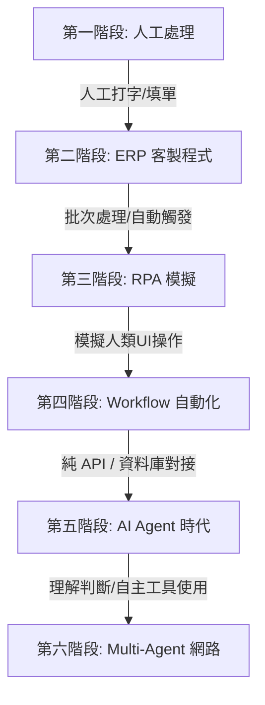

# 主題十：從 ERP 外掛到 AI Agent (class03_rpa_to_agent.md)

* **課程主題**：從 ERP 外掛到 AI Agent
* **副標題**：很多企業其實早已經站在 AI Agent 的前一站
* **授課教師**：鄭穎臨 老師
* **適用模組**：Yinhe Class03

---

## 本章定位

許多人第一次接觸 AI Agent（如 Codex, Antigravity, OpenAI Agent, Gemini Agent）時，容易誤以為這是一個與過去完全斷代、憑空出現的全新技術世界。

但對於 ERP 顧問與系統開發人員而言，其實並非如此。因為**許多 ERP 客製化開發與外掛功能，本質上就是 Workflow Automation（工作流自動化）與 RPA（機器人流程自動化）的應用與延伸。**

---

## 銀河顧問其實很熟悉

在 ERP 系統的日常客製中，以下是極為常見的業務需求：

1. **信用檢查流程**：
   $$\text{訂單建立} \rightarrow \text{系統檢查信用額度} \rightarrow \text{額度不足時寄送 Email/LINE 通知}$$
2. **採購審批流程**：
   $$\text{請購單核准} \rightarrow \text{自動建立採購單} \rightarrow \text{發送即時訊息通知採購人員}$$
3. **安全存量警示**：
   $$\text{庫存低於安全存量} \rightarrow \text{觸發系統寄送警示} \rightarrow \text{發信通知資材主管}$$

這些需求的背後，都遵循著同一個經典的軟體工程模式：

$$\mathbf{Event \ (事件)} \rightarrow \mathbf{Rule \ (規則)} \rightarrow \mathbf{Action \ (行動)}$$

這套模式的本質，就是 **Workflow (工作流)**。

---

## ERP 外掛的演進六階段

從傳統的 ERP 客製外掛到未來的 Multi-Agent 協同網路，企業自動化經歷了以下六個演進階段：

### 第一階段：人工處理 (Manual Process)
* **特徵**：高度依賴人力，人工登入、人工查帳、人工拋單。重複性高、容易出錯且難以追蹤。

### 第二階段：ERP 客製程式 (ERP Customization)
* **特徵**：透過資料庫 Trigger、預存程序 (Stored Procedure) 或 ERP 廠商提供的 SDK/外掛開發工具，在 ERP 內部實現資料自動防呆與欄位拋轉。

### 第三階段：RPA 時代 (Robotic Process Automation)
* **核心目的**：**「讓系統代替人員執行重複性的電腦桌面操作」**。
* **典型場景**：自動登入網銀下載對帳單、自動點擊畫面下載報表、搬運跨系統資料。
* **代表工具**：UiPath, Automation Anywhere, Microsoft Power Automate, Blue Prism。

### 第四階段：工作流自動化 (Workflow Automation)
* **核心思想**：**「不再模仿人點擊畫面，而是直接串接 API、Database、ERP 與雲端服務進行流程自動化」**。
* **代表工具**：n8n, Make, Power Automate Cloud。

### 第五階段：AI Agent 時代 (AI Agentic Era)
* **核心思想**：**「除了執行既定流程，還具備理解模糊需求、自主做出判斷、產生內容並自主呼叫工具 (Tool Use) 的能力」**。
* **代表工具**：Antigravity, Codex, OpenAI Agentic Loop, Gemini Agent。

### 第六階段：Multi-Agent 網路 (Multi-Agent Collaboration)
* **核心思想**：多個具備不同專長角色（如：AI 財務 Agent、AI 庫存 Agent、AI 採購 Agent）的代理人，在統一的工作流治理框架下，進行自主分工、協商與協作。

---

## 為什麼推薦 n8n 作為學習起點？

Force 並不是因為 n8n **「開源」** 或 **「免費」** 才推薦它，更重要的是因為它屬於 **「白箱（White Box）架構」**：

* **資料流向完全透明**：工作流 (Workflow)、內嵌腳本 (Script)、API Request/Response、資料庫 SQL 讀寫，在畫面上皆能被直觀看見與追溯。
* **高可稽核性**：這讓人類與 AI 都能輕鬆理解與維護：
  * **人類容易理解**：交接時不需翻閱厚重 SOP，看圖即懂。
  * **AI 容易理解**：AI Agent 能直接讀取 n8n 的 JSON 定義檔，進行流程分析、改動測試或自動生成節點。

---

## AI 時代的治理新觀念 (AI Governance)

自動化系統引入 AI 後，程式與流程的審查思維也發生了根本性的改變：

* **過去**：人類 Review 程式碼 (Human Review Code)。
* **現在**：AI 輔助 Review 程式碼 (AI Review Code)。
* **未來**：**AI 協同 Review 工作流 (AI Review Workflow)**。

### AI 不僅僅是檢查程式碼，還能協助審查：
1. **流程是否合理**：是否存在死鎖、無限循環或邏輯缺口？
2. **權限是否過大**：AI 呼叫的 API 是否擁有不必要的系統最高權限？
3. **例外處理機制**：遇到 API 超時、ERP 鎖定或資料庫斷線時，是否有對應的 HITL (人機協作) 審批與重試機制？
4. **重複流程與潛在風險**：是否有流程冗餘、資安漏洞或資料洩漏隱憂？

從 **AI Governance (流程治理)** 角度來看，n8n 的白箱流程具有以下巨大優勢：
* **容易稽核、容易追溯、容易交接、容易維護**。
* **便於 AI 進行 Code Review、Workflow Review 與 Security Review**。

---

## Force 觀點

很多企業或開發團隊認為自己距離 AI Agent 還很遙遠。

但實際上，**只要您在企業中做過 ERP 客製化、流程簽核、自動通知或異系統資料交換，您就已經站在 AI Agent 的前一站了。** 

底層的流程思維（Trigger, Workflow, Queue, Approval, Audit Trail）是互通的。只要掌握了這些流程靈魂，即便工具從 ERP 客製演進到 Workflow 自動化，再進化到 AI Agent，您依然能以不變的治理思維駕馭萬變的技術。

---

## 與後續章節銜接

本章的重點不是要學員學會某個特定工具的操作，而是建立 **「ERP 外掛 ➔ RPA ➔ Workflow ➔ AI Agent ➔ Multi-Agent」** 這條持續演進的自動化思維主線。

建立好工作流自動化與治理邊界觀念後，我們就能順利進入 Class 03 後續的主題，包括**《AI 與 AI 的協作》**以及**《Multi-Agent 工作模式》**，這兩者都是 Class 03 最核心的觀念地基。
