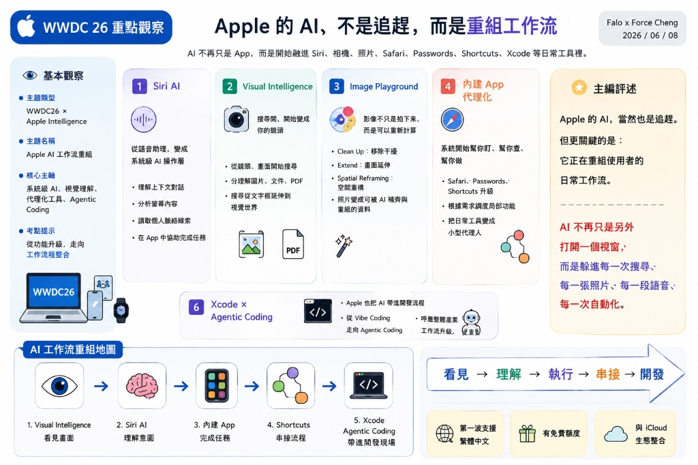

# 主題十一：WWDC 26 全局重點與台灣 SaaS 因應的 Deep Research 實戰 Prompt (class03_wwdc_prompt.md)

* **課程主題**：WWDC 26 全局重點與台灣 SaaS 因應的 Deep Research 實戰 Prompt
* **副標題**：利用高階 Prompt 驅動 AI 進行技術全局盤點與企業自動化因應戰略分析
* **授課教師**：鄭穎臨 老師
* **適用模組**：Yinhe Class03

---

## 本章定位

在 AI 時代的 **Vibe Coding** 與 **知識工程** 實踐中，如何向 AI 提問，決定了您獲得知識的上限。

本章做為一個實戰範例，展示如何撰寫一份「無遺漏、有深度、且能緊密對接企業現況」的 **Deep Research Prompt**。我們將以 Apple WWDC 26 發表會為調研對象，引導 AI 先進行大會技術全局大盤點（Part 1：在講啥），再深度挖潛其對台灣 SaaS 廠商與企業 ERP 治理的衝擊與因應之道（Part 2：怎麼辦）。這份提示詞是學員在企業中進行「AI 戰略與技術研究」的絕佳模板。

---

## WWDC 26 重點觀察架構圖

下圖為 Force 顧問團隊針對 WWDC 26 整理的「工作流重組」重點地圖。在執行 Deep Research 之前，您可以先以此圖做為概念指引：



---

## Deep Research 實戰 Prompt

您可以直接複製以下 Prompt，丟給具備深度搜尋與研究能力的 AI（如 Perplexity Pro, ChatGPT Deep Research, Claude 等）執行研究：

```markdown
# Role & Expertise
你是一位享譽國際的「科技產業戰術分析師」與「SaaS 產品架構治理專家」。你精通 Apple 生態系技術、全球軟體產業趨勢，以及台灣中小企業（SME）的 ERP 導入與流程治理。

# Research Objective
請針對「WWDC 26（Apple 全球開發者大會）」展開深度搜尋與研究，並將報告明確切分為以下兩大部分：

---

## Part 1: WWDC 26 全局發表會重點完整盤點（大會到底講了啥？）

請無偏差、無遺漏地全面搜集並整理 WWDC 26 大會的「所有核心重點」，建立完整的全局技術圖譜：

1. 【各大作業系統重大更新 (OS Updates)】：
   - iOS, macOS, iPadOS, watchOS, visionOS 等最新系統的核心功能演進、全新 UI 互動邏輯與非 AI 的重要技術變更。
2. 【Apple Intelligence (AI) 全局架構與隱私防線】：
   - Apple Intelligence 這次公布了哪些全新功能、模型架構與跨 App 運作方式？
   - 隱私保護機制（如 Private Cloud Compute 私有雲端運算）的技術細節與資料安全邊界是什麼？
3. 【開發者工具與技術生態 (Developer Tools & SDKs)】：
   - 最新版 Xcode 釋出了哪些功能（特別是 AI 輔助、Agentic Coding、Playgrounds 等）？
   - 這次大會新增或修改了哪些關鍵的 SDK、API 框架（如 App Intents, Swift, SwiftUI）？
4. 【其他硬體、服務與生態系整合亮點】：
   - 大會上發表的其他重要服務或生態系整合重點。

---

## Part 2: 針對台灣 SaaS / ERP 服務商的生存與因應戰略（台灣 SaaS 廠商該如何因應？）

基於 Part 1 蒐集到的全局重點，從中篩選出對「企業工作流、SaaS 開發、流程自動化與治理」有深遠影響的技術。結合台灣中小企業（SME）預算有限、高客製化、且重視「白箱流程治理（去識別化、例外處理、Audit Trail）」的現場，探討台灣 SaaS 廠商的因應策略：

1. 【從局更新看「介面消亡與能力包化」的必要性】：
   - 結合 iOS/macOS 的全局代理化更新，台灣 SaaS/ERP 廠商是否應該徹底放棄開發原生 App，轉而將 ERP 功能封裝為「App Intents / Shortcuts 能力包」與 OpenAPI，供 OS 級 Agent 在背景調用？
   - ERP 應如何設計 Schema 與 API 邊界？
2. 【AI Governance（流程治理）新防線】：
   - 當員工開始用 Apple Intelligence 的系統級代理功能自動操作 ERP 流程時，如何防範 AI 越權與個資洩漏？
   - ERP 廠商應如何架構其「例外處理機制（HITL）」與「稽核軌跡（Audit Trail）」以把關安全？
3. 【Xcode 新功能對台灣 ERP 客製外掛開發的實務衝擊】：
   - ERP 廠商如何運用最新 Xcode 的 AI 輔助與 Agentic Coding 提升外掛開發產能？
   - 如何確保 AI 自動產生的外掛符合「白箱可視化（如 n8n 工作流結構）」特徵，以便於日後維護與交接？
4. 【商業模式轉型】：
   - 台灣 SaaS 廠商如何防止自己被 OS 級 Agent 邊緣化？
   - 如何將 Part 1 提到的技術變革，轉化為「工作流治理與 API 調用訂閱」的獲利新機會？

---

# Output Requirements
1. 【語系要求】：請完全使用流暢的繁體中文（台灣習慣用語）輸出，技術專有名詞保留英文。
2. 【格式結構】：條理清晰，Part 1 請提供結構化的「全局重點彙整表」，Part 2 則提供針對台灣 SaaS 的「實務應變指引」。
```

---

## 與後續章節銜接

本章展示了高階 Prompt 在知識工程調研中的威力。掌握這套「全局盤點 ➔ 垂直因應」的提問思維，不僅能幫我們快速消化最新的 WWDC 大會重點，更是未來在 Class 04 進行**多代理人（Multi-Agent）系統整合**時，規劃 AI 與企業私有知識庫交互的基礎提示工程心法。
