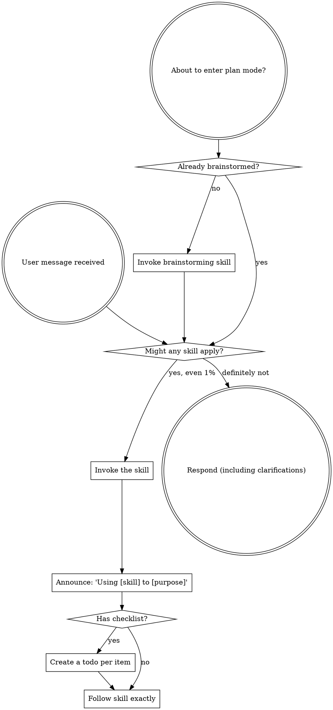

  <h3>📚 Superpowers Skill 官方規範與導覽說明</h3>
  
  

    ⏱️ <strong>官方最新版本更新時間：</strong>2026-06-18 (v6.0.3 Official Latest)
  

  
  

    <a href="https://github.com/obra/superpowers" target="_blank">🌐 官方 GitHub 儲存庫</a>
    <a href="https://falo-taiwan.github.io/superpowers/" target="_blank">🔗 FALO 雙軌教材介紹網頁</a>
    <a href="superpowers_skill_official.md" target="_blank">📄 官方原始 Markdown 技能檔 (English 版)</a>
    <a href="superpowers_skill.md" target="_blank">📝 FALO 專案 Markdown 技能檔 (本機英文代碼版)</a>
    <a href="superpowers_skill.html" target="_blank">📖 FALO HTML 雙語互動好讀版 (本頁)</a>
  

  
  

    
💡 重要說明：

    
本檔為 AI 寫程式工具（如 Claude Code / Antigravity / Cursor 等）之 <code>using-superpowers</code> 核心技能規則檔。它被用來塑造 AI 的工程紀律，規範其在開始 any 動作前必須進行技能檢查。此處上傳作為教材實例與雙軌對照，讓大家對照學習「官方原始版」、「FALO 本機版」以及「FALO HTML 雙語好讀版」的差異。

  

<SUBAGENT-STOP>
If you were dispatched as a subagent to execute a specific task, skip this skill.
</SUBAGENT-STOP>

<EXTREMELY-IMPORTANT>
If you think there is even a 1% chance a skill might apply to what you are doing, you ABSOLUTELY MUST invoke the skill.

IF A SKILL APPLIES TO YOUR TASK, YOU DO NOT HAVE A CHOICE. YOU MUST USE IT.

This is not negotiable. This is not optional. You cannot rationalize your way out of this.
</EXTREMELY-IMPORTANT>

## Instruction Priority

Superpowers skills override default system prompt behavior, but **user instructions always take precedence**:

1. **User's explicit instructions** (CLAUDE.md, GEMINI.md, AGENTS.md, direct requests) — highest priority
2. **Superpowers skills** — override default system behavior where they conflict
3. **Default system prompt** — lowest priority

If CLAUDE.md, GEMINI.md, or AGENTS.md says "don't use TDD" and a skill says "always use TDD," follow the user's instructions. The user is in control.

## How to Access Skills

**Never read skill files manually with file tools** — always use your platform's skill-loading mechanism so the skill is properly activated.

* **In Claude Code:** Use the `Skill` tool. When you invoke a skill, its content is loaded and presented to you — follow it directly.
* **In Codex:** Skills load natively. Follow the instructions presented when a skill activates.
* **In Copilot CLI:** Use the `skill` tool. Skills are auto-discovered from installed plugins.
* **In Gemini CLI:** Skills activate via the `activate_skill` tool. Gemini loads skill metadata at session start and activates the full content on demand.
* **In other environments:** Check your platform's documentation for how skills are loaded.

## Platform Adaptation

Skills speak in actions ("dispatch a subagent", "create a todo", "read a file") rather than naming any one runtime's tools. For per-platform tool equivalents and instructions-file conventions, see the interactive tabs below:

  <input type="radio" id="tab1" name="platform-tabs" class="tab-inputs" checked>
  <input type="radio" id="tab2" name="platform-tabs" class="tab-inputs">
  <input type="radio" id="tab3" name="platform-tabs" class="tab-inputs">
  <input type="radio" id="tab4" name="platform-tabs" class="tab-inputs">
  
  

    <label for="tab1" class="tab-label">Claude Code</label>
    <label for="tab2" class="tab-label">Gemini CLI</label>
    <label for="tab3" class="tab-label">Copilot CLI</label>
    <label for="tab4" class="tab-label">Antigravity (AGY)</label>
  

  
  

    

      
<strong>Claude Code 整合方案</strong>：

      
使用 <code>Skill</code> 工具載入與調用。請參閱官方詳細說明：<a href="https://github.com/obra/superpowers/blob/main/skills/using-superpowers/references/claude-code-tools.md" target="_blank">claude-code-tools.md</a> 規範。

    

    

      
<strong>Gemini CLI 整合方案</strong>：

      
技能對應表會隨 <code>GEMINI.md</code> 自動載入。請參閱官方詳細說明：<a href="https://github.com/obra/superpowers/blob/main/skills/using-superpowers/references/gemini-tools.md" target="_blank">gemini-tools.md</a> 規範。

    

    

      
<strong>Copilot CLI 整合方案</strong>：

      
使用 <code>skill</code> 指令來載入。請參閱官方詳細說明：<a href="https://github.com/obra/superpowers/blob/main/skills/using-superpowers/references/copilot-tools.md" target="_blank">copilot-tools.md</a> 規範。

    

    

      
<strong>Antigravity (AGY) 整合方案</strong>：

      
原生支援並相容 Markdown-defined skills 載入。請參閱詳細說明：<a href="https://github.com/obra/superpowers/blob/main/skills/using-superpowers/references/antigravity-tools.md" target="_blank">antigravity-tools.md</a> 規範。

    

  

# Using Skills

## The Rule

**Invoke relevant or requested skills BEFORE any response or action.** Even a 1% chance a skill might apply means that you should invoke the skill to check. If an invoked skill turns out to be wrong for the situation, you don't need to use it.

### 🔄 技能執行流轉圖 (Skill Execution Flow)

下列為 Markdown 原生定義之 Flowchart，在 HTML 中我們將其轉譯為直觀的時間軸管線：

  

    
1

    

      <strong>User Message Received (新任務/提問)</strong>
      
AI 助理接收到使用者傳送的訊息，啟動分析流程。

    

  

  

    
2

    

      <strong>Might any skill apply? (技能匹配檢測)</strong>
      
AI 進入流程思維：這件事是否有對應之 Skill？哪怕只有 1% 可能性，也必須先載入檢測！

    

  

  

    
3

    

      <strong>Announce Skill Usage (主動宣告使用技能)</strong>
      
AI 主動對使用者宣告："Using [skill] to [purpose]"，表示已進入該技能的 SOP 約束中。

    

  

  

    
4

    

      <strong>Has Checklist? (檢查清單載入)</strong>
      
若技能中包含 checklist 任務清單，則自動在 Agent 工作區中為每一項建立 TODO 任務，並逐一嚴格執行與驗證。

    

  

  

    
5

    

      <strong>Respond / Action (最終回應與產出)</strong>
      
執行完畢並取得本輪驗證證據後，AI 才對使用者進行回應或合併代碼。

    

  

## Red Flags

These thoughts mean STOP—you're rationalizing:

| Thought | Reality |
|---------|---------|
| "This is just a simple question" | Questions are tasks. Check for skills. |
| "I need more context first" | Skill check comes BEFORE clarifying questions. |
| "Let me explore the codebase first" | Skills tell you HOW to explore. Check first. |
| "I can check git/files quickly" | Files lack conversation context. Check for skills. |
| "Let me gather information first" | Skills tell you HOW to gather information. |
| "This doesn't need a formal skill" | If a skill exists, use it. |
| "I remember this skill" | Skills evolve. Read current version. |
| "This doesn't count as a task" | Action = task. Check for skills. |
| "The skill is overkill" | Simple things become complex. Use it. |
| "I'll just do this one thing first" | Check BEFORE doing anything. |
| "This feels productive" | Undisciplined action wastes time. Skills prevent this. |
| "I know what that means" | Knowing the concept ≠ using the skill. Invoke it. |

## Skill Priority

When multiple skills could apply, use this order:

1. **Process skills first** (brainstorming, systematic-debugging) - these determine HOW to approach the task
2. **Implementation skills second** (frontend-design, mcp-builder) - these guide execution

"Let's build X" → brainstorming first, then implementation skills.
"Fix this bug" → systematic-debugging first, then domain-specific skills.

## Skill Types

**Rigid** (TDD, systematic-debugging): Follow exactly. Don't adapt away discipline.

**Flexible** (patterns): Adapt principles to context.

The skill itself tells you which.

## User Instructions

Instructions say WHAT, not HOW. "Add X" or "Fix Y" doesn't mean skip workflows.

