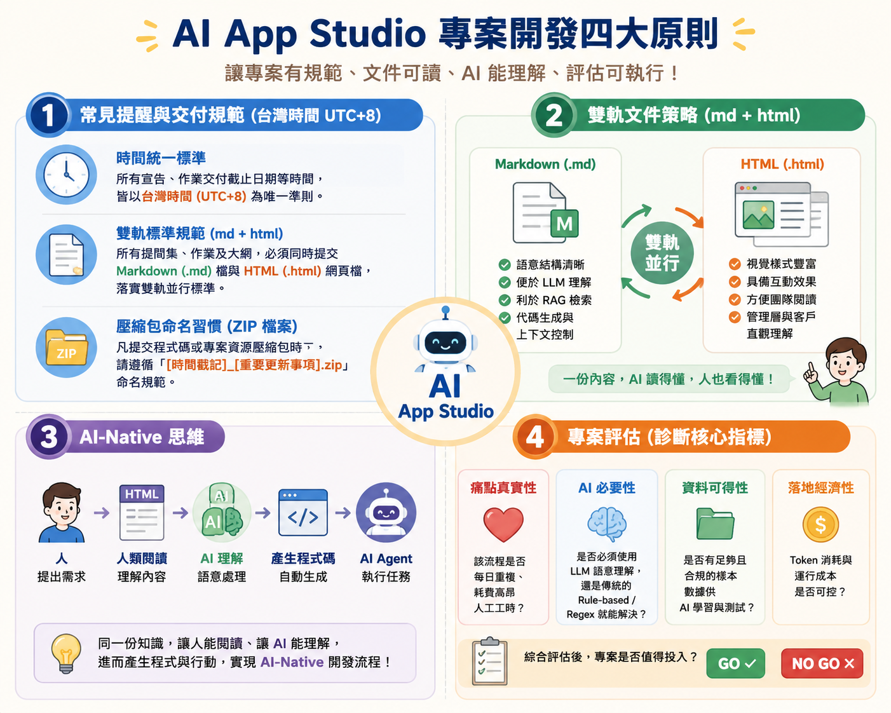
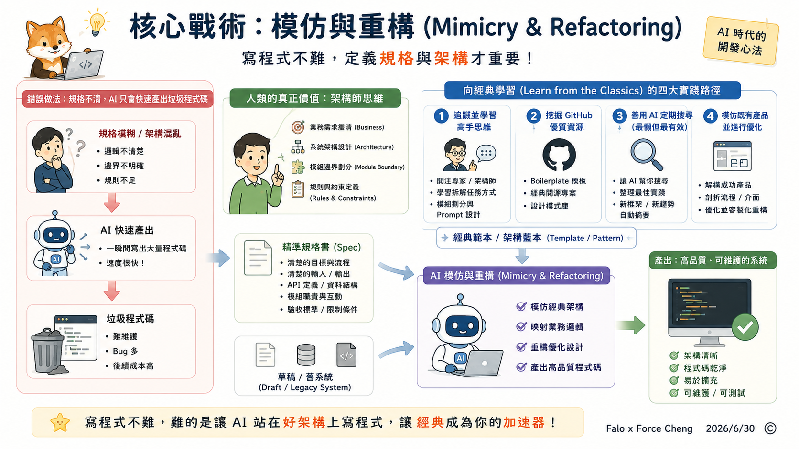
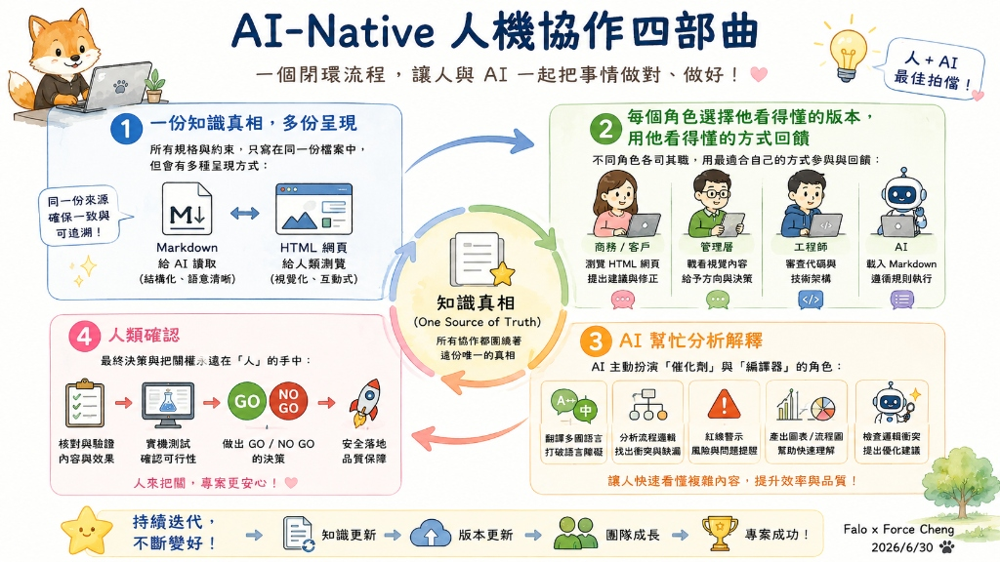
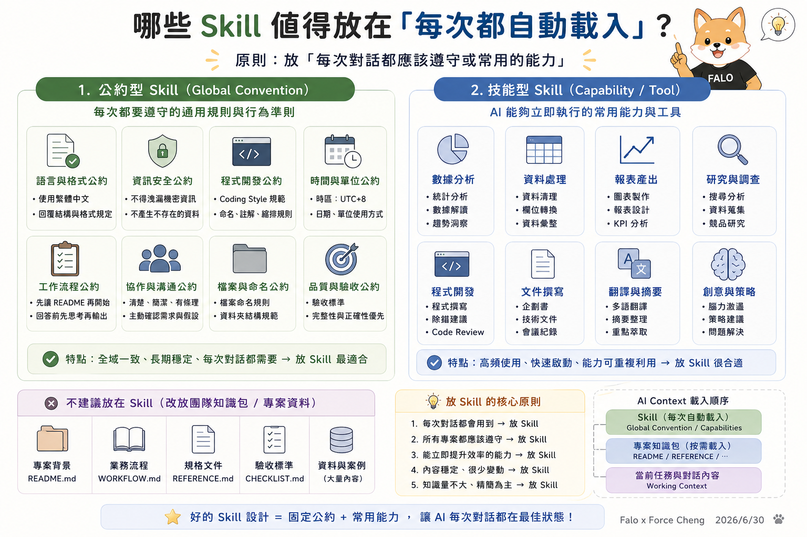

# 主題一：前三堂課程交流與補充

> [!NOTE] 📂 **前三堂課程簡報 PDF 下載與存取說明** • **Class 1 課程簡報**：<a href="javascript:void(0);" onclick="verifyPdfPassword('https://drive.google.com/file/d/1lcTQQ4ceWf8-I-qxifTIbkTq8gwW0Pp7/view')" style="color: var(--accent); font-weight: bold; text-decoration: underline;">🌐 Google Drive 下載連結</a> • **Class 2 課程簡報**：<a href="javascript:void(0);" onclick="verifyPdfPassword('https://drive.google.com/file/d/1FV_SEjwf68vgd_CH28ScJSjz1FiwxxTw/view')" style="color: var(--accent); font-weight: bold; text-decoration: underline;">🌐 Google Drive 下載連結</a> • **Class 3 課程簡報**：<a href="javascript:void(0);" onclick="verifyPdfPassword('https://drive.google.com/file/d/1XDK6z2988pxJ0mIHCvgQmjFEHVCc2UeM/view?usp=sharing')" style="color: var(--accent); font-weight: bold; text-decoration: underline;">🌐 Google Drive 下載連結</a> • 🔑 **PDF 檔案密碼提示**：公司英文縮寫。

本單元旨在對前三週的學習重點進行深度沉澱與補充，並以 AI App Studio 的核心原則為基礎，規範專案開發、雙軌文件、AI 理解與指標評估。

---

## 📌 主題一：常見提醒與交付規範 (台灣時間 UTC+8) {#guidelines}

> [!IMPORTANT]
> 本課程與專案之所有宣告、作業交付截止日期等時間，皆**統一宣告並以台灣時間 (UTC+8) 為唯一準則**。

* 🕒 時間統一標準：所有宣告、作業交付截止日期等時間，皆以台灣時間 (UTC+8) 為唯一準則。
* 📄 雙軌標準規範 (md + html)：所有提問集、作業及大綱，必須同時提交 **Markdown (.md)** 檔與 **HTML (.html)** 網頁檔，落實人機雙軌並行。
  * **Markdown 檔**：供 AI / LLM 結構理解，利於上下文控制與代碼生成。
  * **HTML 網頁檔**：供人類清晰閱讀，方便直觀展示與簡報。
* 📦 壓縮包命名習慣 (ZIP 檔案)：凡提交程式碼或專案資源壓縮包時，請遵循 **「[時間戳記]_[重要更新事項].zip」** 命名規範（例如：`20260630_class04_project.zip`）。

---

## 📌 主題二：雙軌文件策略 (md + html) {#double-track}

在 AI-Native 開發模式下，文件兼顧人機雙軌並行，達成「一份內容，AI 讀得懂，人也看得懂」：

* 📝 Markdown (.md)：語意結構清晰，便於 LLM 語意理解，利於 RAG 檢索，方便代碼生成與上下文控制。
* 🌐 HTML (.html)：視覺樣式豐富，具備互動效果，方便團隊成員閱讀，以及管理層與客戶直觀理解。

### 🚀 案例研究：Superpowers 的 HTML 本地化與雙軌優勢
在 AI-Native 開發中，我們以知名 AI 技能庫 [Superpowers](https://github.com/obra/superpowers) 為例，展示同一個技能檔在不同表達載體上的雙軌輸出與優勢。詳細的「HTML 本地化優勢與功能展示」已收錄於我們的 [FALO 雙軌教材介紹網頁](https://falo-taiwan.github.io/superpowers/) 中。

本教材包中提供以下三種檔案版本，供您對照學習其結構與轉譯效果：
* 🌐 <a href="superpowers_skill_official.md" target="_blank">官方原始 Markdown 技能檔 (superpowers_skill_official.md)</a>：最純粹的官方英文邏輯，適合配置給 AI 工具。
* 📝 <a href="superpowers_skill.md" target="_blank">FALO 專案 Markdown 技能檔 (superpowers_skill.md)</a>：本機英文代碼版，嵌入了 CSS/HTML 互動組件。
* 📖 <a href="superpowers_skill.html" style="color: #fb923c; font-weight: bold; text-decoration: underline;">FALO HTML 雙語互動好讀版</a>：透過編譯注入中文導讀、互動平台 Tabs 與視覺化 Timeline 的最強學習版本。

### 🎨 實務視覺強化戰術：人機協作繪圖

為了讓 HTML 網頁具備「Wow」的視覺效果，我們在撰寫 HTML 文件時常使用以下兩種戰術來繪製高質感的示意圖：

* ⚡ 使用行內 SVG (Inline SVG) 繪製輕量示意圖
  HTML 支援直接嵌入 SVG 向量代碼。你可以直接命令 AI 生成簡潔、無損放大的 SVG 結構圖或流程圖解（例如我們在教材中使用的架構圖）。這類圖表加載速度極快，且完美適應響應式排版，是人機共讀的首選。
* 🤖 藉由 AI 生圖工具進行視覺強化
  當內建的 SVG 示意圖精緻度不夠，或需要更具象的產品概念圖與插畫時，我們可以借助已全面升級的頂尖 AI 工具協作生圖，再將圖片下載放入網頁中：
  * **ChatGPT Image 2**：適合快速產生富有創意的概念插圖、系統運作擬人化圖解或 UI 介面 Mockups。
  * **Gemini Banana 2**：擅長生成清晰俐落的向量風格插圖、寫實工作場景與精確的示意資產（如我們專案中使用的 Ornith 吉祥物）。
  * **NotebookLM（資訊圖表與簡報）**：適合將複雜長文或專案背景直接丟入，讓 AI 快速提煉核心邏輯，直接生成最適合簡報或網頁呈現的「資訊圖表」大綱與視覺排版結構，省去大量人工整理的時間。

---

## 📌 主題三：AI-Native 思維 {#ai-native}

### 1. AI-Native 開發流程：從「人出嘴」到「AI 自動執行」
在 AI-Native 的開發模式下，人類不再需要親自動手寫每一行程式碼，而是透過**一份結構化的雙軌文件**來直接指揮 AI。整個流轉路徑如下：

**👤 人類（提出需求）** ➔ **📄 雙軌文件（人讀 HTML，AI 讀 MD）** ➔ **🤖 AI 引擎（理解規則與邏輯）** ➔ **💻 產生代碼（自動編寫）** ➔ **⚙️ AI Agent（自動測試執行）**

### 2. 核心戰術：模仿與重構 (Mimicry & Refactoring)
在 AI-Native 的時代，寫程式碼的門檻已經降到極低，語法與基礎實作不再是難事。**工程師與開發者真正的核心價值，已經轉移到「設計架構 (Architecture)」與「撰寫精準的規格書 (Spec)」。**

為了讓 AI 產出最高品質的程式碼，我們必須掌握**「向經典學習，讓 AI 模仿重構」**的戰術：

* 💡 寫程式不難，定義規格與架構才重要
  AI 可以一瞬間寫出上千行代碼，但如果人類給的「規格書 (Spec)」邏輯混亂、架構模糊，AI 也只會以極快的速度產出「垃圾程式碼」。人類的角色必須提升為「架構師」，專注於理清業務邊界與系統規則。
* 📚 向經典學習 (Learn from the Classics) 的四大實踐路徑
  我們無須閉門造車、憑空發明架構輪子，而是要去挖掘世界上的「優秀經典」作為 AI 模仿的對象。以下是獲取經典的四個核心方法：
  1. **🎯 追蹤並學習高手思維**：關注業界頂尖專家、資深架構師與先進開發社群，觀察他們如何向 AI 拆解任務、如何劃分 Module 與設計 Prompt，吸收他們的思維模型。
  2. **🐙 挖掘 GitHub 等優質資源站**：在 GitHub 上尋找熱門的 Boilerplate（腳手架模板）、經典的開源專案與設計模式庫，直接將其成熟、通過驗證的架構作為 AI 仿效的藍本。
  3. **🤖 善用 AI 定期搜尋（最懶但最有效）**：讓 AI 當作你的情報特工，定期幫你搜尋、整理並摘要業界最新的開發最佳實踐 (Best Practices)、新框架設計與優秀程式碼規範。
  4. **🔄 模仿既有產品並進行優化**：解構市場上已成功且通過商用驗證的產品，剖析其流程、介面與功能架構，讓 AI 在模仿其長處的基礎上，進行客製化重構與優化。
* 🛠️ 模仿與重構 (Mimicry & Refactoring) 的執行方式
  將我們的草稿或舊系統提供給 AI，並附上上述途徑取得的經典範本，命令 AI：「*以此範本為標準，模仿其架構來重構我的系統*」。AI 會利用強大的語意類比與映射能力，將新的業務邏輯無縫嵌入經典架構中，瞬間將代碼品質提升至資深架構師的水準。

### 3. AI-Native 人機協作四部曲：高效協作的核心機制
在 AI-Native 的工作流中，人與 AI 的協作不再是傳統指令式的對話，而是圍繞著「文件與知識」展開的閉環流轉：

* 📄 一份知識真相，多份呈現 (One Source of Truth, Multiple Presentations)
  所有的業務規格與行為約束只寫在同一個檔案中。但這個檔案會有多種呈現形式：給 AI 讀取的是結構化、語意清晰的 Markdown 全文；給人類看的是視覺精美、具備互動效果與時間軸的 HTML 網頁。
* 👥 每個角色選擇他看得懂的版本，用他看得懂的方式回饋
  不同角色各司其職：商務端、管理層或客戶瀏覽 HTML 視覺網頁，並用自然語言提出回饋與修正建議；工程師審查代碼與技術架構；AI 則直接載入並嚴格遵循 Markdown 規則。每個人都用自己最舒服、最有效率的載體進行溝通與回饋。
* 🤖 AI 幫忙分析解釋 (AI-Assisted Analysis & Translation)
  在協作過程中，AI 會主動扮演「催化劑」與「編譯器」角色：自動翻譯多國語言、分析代碼邊界、檢查邏輯衝突、產出紅線警示與視覺化流程圖，幫助人類跨越技術鴻溝，快速看懂代碼或複雜規則的實質影響。
* 👤 人類確認 (Human Verification & Control)
  不論 AI 的生成與編譯能力再強，最終的決策與把關權永遠在「人」的手中。由人類在 HTML 互動介面上核對最終效果，進行實機測試，並做出 GO / NO GO 的決策，確保專案的安全落地與品質保障。

### 4. 導入 AI-Native 思維的四大顯著優勢
當我們轉向以「設計架構與規格，讓 AI 模仿重構」為核心的 AI-Native 模式時，將獲得以下顯著優勢：

* 🎯 規格即代碼，消除架構與實作的脫節
  在傳統開發中，規格書與實際代碼經常脫節（Out of Sync）。而在 AI-Native 模式下，**規格文件就是 AI 的程式指令**。當人類架構師更新了經典模板或規格公約後，AI 便會立即在後續對話或重構中嚴格執行，實現「規格即程式」，消滅資訊不對稱。
* ⚡ 消除繁瑣的手工轉譯 (Specification to Code)
  以往工程師需要花費大量時間把設計文件或 PM 的規格「翻譯」成程式代碼。現在，人類專注於設計出高水準的規格架構，AI 則直接讀懂規格文件並自動完成手工代碼的撰寫與轉換，大幅降低人工轉譯的出錯率。
* 🔄 極速架構實驗與自動化閉環
  有了「模仿重構」的戰術，當我們想嘗試新的系統架構時，只需替換 AI 參照的「黃金範本」即可。AI 能在幾分鐘內自動完成整個系統的代碼替換、單元測試、編譯與發布，讓架構實驗與驗收呈指數級加速。
* 🗣️ 極低溝通成本與高度敏捷性
  當業務邏輯或系統規範有變動時，無須召開繁瑣的跨部門重構會議或代碼審查會議，只需更新該單元之 Markdown 規格。AI Agent 載入後便會自動更新其行為模式，讓開發流程達到真正的敏捷（Agile）。

---

## 📌 主題四：專案評估 (診斷核心指標) {#project-evaluation}

在啟動 AI 專案或導入工具前，必須通過以下四項核心指標的 GO / NO GO 診斷評估：

1. ❤️ 痛點真實性：該業務流程是否為每日重複、耗費高昂人工工時的痛點？
2. 🧠 AI 必要性：是否必須使用 LLM 進行語意理解與複雜決策？還是傳統的 Rule-based (規則/公式) 或 Regex (正規表示式) 就能解決？
3. 📁 資料可得性：專案是否有足夠且合規的真實樣本數據，以供 AI 學習、對照與測試？
4. 💰 落地經濟性：Token 的消耗、API 呼叫與運行維護成本，在商業上是否可控且具備投資報酬率？

綜合評估後，確認專案是否值得投入（GO / NO GO）。

---

## 📌 主題五：怎麼善用 Agent Skills {#agent-skills}

善用 AI 技能 (Skills) 與團隊知識管理是提升人機協作效率的關鍵，以下透過三張核心圖表進行深度解析：

### 1. 能力 (Skills) 與知識 (Knowledge) 的定位差異

* 個人使用 (Personal AI) ➔ 管理「能力 (Skill)」
  透過 `Skill.md` 定義 AI 助理的行為準則與工具調用流程，注入 AI 執行階段 (AI Runtime)，讓 **AI 自己變強**。
* 團隊使用 (Team AI) ➔ 管理「知識 (Markdown + HTML)」
  建立專案共享文件目錄（如 `README`、`PROJECT_RULE`、`WORKFLOW`），落實雙軌並行，讓 **大家使用同一份知識與規範**。

---

### 2. Context 與 Token 的資源優化策略

* Skill 模式（常駐外掛 🔌）：每次啟動對話時，AI 都會自動載入該 Skill 的 Markdown 全文（Always Loaded）。雖然反應即時，但會固定且持續佔用 Context 空間，並消耗重複的 Input Token。
* Team Knowledge 模式（專案資料庫 🗄️）：平時檔案安靜存放在目錄中，AI 僅在需要時才經由搜尋或讀取工具載入特定檔案（On Demand）。不佔用啟動時的 Context，使資源利用率最大化。

---

### 3. 哪些 Skill 值得放在「每次都自動載入」？

* 原則：放「每次對話都應該遵守或常用的能力」。
* 公約型 Skill (Global Convention)：每次都要遵守的通用規則與行為準則。
  * *包含*：語言與格式公約、資訊安全公約、程式開發公約、時間與單位公約、工作流程公約、協作與溝通公約、檔案與命名公約、品質與驗收公約。
* 技能型 Skill (Capability / Tool)：AI 能夠立即執行的常用能力與工具。
  * *包含*：數據分析、資料處理、報表產出、研究與調查、程式開發、文件撰寫、翻譯與摘要、創意與策略。
* 不建議放在 Skill（改放團隊知識包）：專案背景 (`ai_app_readme.md`)、業務流程 (`WORKFLOW.md`)、規格文件 (`REFERENCE.md`)、驗收標準 (`CHECKLIST.md`)、大量真實案例數據。
* AI Context 載入順序：
  **1. Skill（每次自動載入）** ➔ **2. 專案知識包（按需載入）** ➔ **3. 當前對話任務（Working Context）**

> **好的 Skill 設計 = 固定公約 + 常用能力，讓 AI 每次對話都在最佳狀態！**
