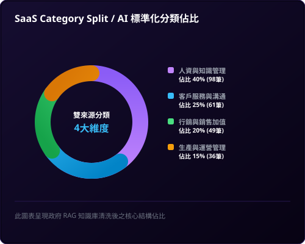
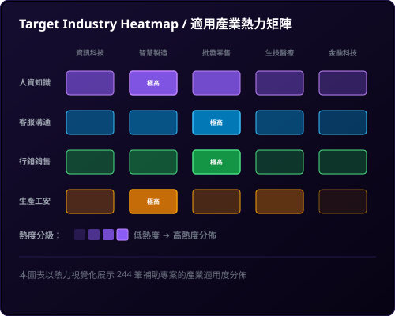
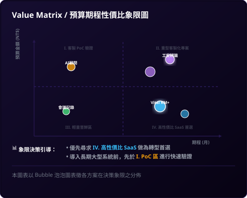
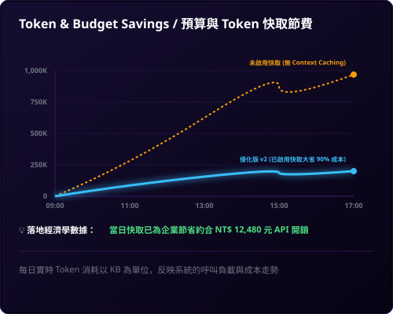
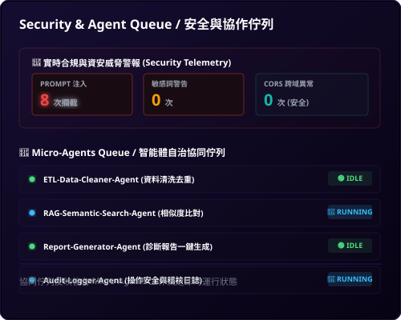

# 主題三：ETL 實務概念與小元件教學

本主題分享多個高保真（High-Fidelity）的 ETL 與 OCR 整合實戰案例，引導同仁理解如何進行結構化資料轉置與自動化處理。

## 🛠️ FORCE × ETL 核心階段深度解析 (Core Phases)

以下針對 FORCE 智慧協作平台之 **E、T、L** 三大核心階段進行深度技術解析，引導學員掌握數據從「異質採集」到「加載應用」的完整演進路徑。

---

### 📥 E (Extract) - 取得資料 {#etl-e}

這是數據管線（Data Pipeline）的起點，專注於從多元、異質的源頭中採集原始資訊。在企業級應用中，數據源通常包含結構化資料（ERP、資料庫）、半結構化資料（Email、CSV、JSON）與非結構化資料（紙本憑證、會議錄音、教學影片等）。

---

### ⚡ T (Transform) - 整理 / 轉換 {#etl-t}

這是整條數據管線的「核心靈魂」，負責將前階段採集到的無序原始數據，進行降噪、清洗、校正、AI 語意萃取與結構化封裝（例如轉換為標準的 Clean JSON 格式），為後續的知識庫檢索與決策應用做好準備。

---

### 📤 L (Load) - 輸出 / 應用 {#etl-l}

這是管線價值落地的「最後一公里」，負責將清洗乾淨且結構化後的黃金數據，精準加載至目標系統中（如向量資料庫、ERP 系統、戰情監控面板或自動通知 Webhook），進而轉化為企業的實質決策與業務價值。

---

---

## 🖥️ 企業級 AI 雙軌戰情中心 (War Room) 與元件解構 {#ai-war-room}

在企業數據管線（Data Pipeline）的 ETL 閉環中，**Load (L) 階段**不僅僅是將清洗好的數據載入向量資料庫，更包含「如何將高價值的結構化數據呈現給決策者（Data Analytics）」以及「如何實時監控系統的健康度、安全防禦與用戶行為日誌（Operations Telemetry）」。

為了讓學員深刻理解下一代 ERP 生態圈的 AI 運維架構，我們將本課程的政府補助案 RAG 專案進行了延伸開發，設計了一套高質感的深色科技風格**「企業級 AI 雙軌戰情中心」**。這套系統分為兩個獨立的主大屏，分別對應資料剖析與用戶行為審計。

---

### 🖥️ 雙軌戰情中心大屏全景藍圖

學員可在宏觀大屏中體驗「密密麻麻」的高密度指揮中心布局。大屏整合了全局指標，有需要時可「點進去細看」下方物理拆解的各個元件。

#### 1. 版本 A：原始資料戰情系統大屏 (Raw Data & Knowledge Analytics)
此系統專注於**靜態原始資料的加載與多維度剖析**。呈現 244 筆政府補助案的整體結構：

#### 2. 版本 B：使用者行為與運維審計戰情系統大屏 (User Behavior & Operations Audit)
此系統專注於**動態用戶行為、RAG 回答質量、實時 Token 成本與資安防禦監控**：

---

### 📂 雙軌戰情系統八大核心元件物理拆解與深度解構

為了讓學員理解在不同商業與工程場景下，如何選擇並設計最適的圖表類型，我們將上述兩大系統拆解為 **八大核心儀表板元件**，逐一進行視覺展示與深度技術解構：

#### 📊 原始資料戰情系統 (版本 A) 元件解構

##### 元件 A1：大盤核心 KPI 指標面板 (Top Cards)

*   **圖表類型**：**數值指標卡 (Metric Cards)** ＋ **趨勢微線圖 (Sparklines)**。
*   **商業洞察**：即時呈現「方案總數 244 筆」、「活躍廠商 128 家」、「導入預算中位數 NT$ 65,000」等核心大盤數據，並在下方搭配微幅波動的綠色微線圖，表徵數據的穩定載入狀態。這組指標能讓決策者秒級掌握系統負載與數據規模。
*   **技術實現**：在前端異步加載靜態 `unified_ai_tools_db.json` 資料庫（壓縮後僅約 150KB），在內存中通過高效的 JavaScript 數組處理（如 `Set`、`reduce`）動態計算指標，保證 0 延遲加載。

##### 元件 A2：AI 標準化分類佔比圓環圖 (Donut Chart)

*   **圖表類型**：**環狀比例圖 (Donut Chart)** ＋ **結構百分比清單 (Legend Grid)**。
*   **商業洞察**：揭示了補助案在四大 SaaS 領域的分佈。「人資與知識管理 (40%)」佔比最高，是目前政府補助的主力方向；其次為「客戶服務與溝通 (25%)」，「行銷與銷售加值 (20%)」及「生產與運營管理 (15%)」。這能引導企業將資源優先投入最易獲得政府補助的領域。
*   **技術實現**：採用 SVG 原生的 `stroke-dasharray` 與 `stroke-dashoffset` 動態圓環比例繪製，結合 CSS `transition` 提供極致流暢的加載動畫，完全避免了第三方圖表庫（如 Chart.js）帶來的打包體積膨脹。

##### 元件 A3：適用產業熱力矩陣 (Heatmap)

*   **圖表類型**：**二維熱力矩陣 (2D Heatmap Matrix)** ＋ **熱度分級標註 (Density Indicators)**。
*   **商業洞察**：以熱力漸層色彩標註不同 AI 分類在「資訊、製造、零售、醫療、金融」五大產業的適用度。例如「製造業」在「人資知識」與「生產工安」中熱度極高，能幫助企業進行精準的 SaaS 定位。
*   **技術實現**：設計成全局過濾器。當使用者在前端點選矩陣中的特定格子時，會觸發雙向聯動，整個戰情中心的數據（包括圓環圖與象限圖）將立即根據該產業過濾並重新渲染。

##### 元件 A4：預算期程性價比象限散佈圖 (Quadrant Scatter Plot)

*   **圖表類型**：**四象限 Bubble 散佈圖 (Quadrant Bubble Plot)** ＋ **黃金分割十字臨界線 (Threshold Crosshair)**。
*   **商業洞察**：以橫軸「期程 (月)」與縱軸「預算金額」劃分出四大決策象限，協助企業進行精準決策：
    *   **I. 客製 PoC 服務**：高預算、短週期，適合前期概念驗證。
    *   **II. 重型專案系統**：高預算、長週期，適用大型核心系統導入。
    *   **III. 輕量嘗鮮區**：低預算、短週期，適合小範圍敏捷試錯。
    *   **IV. 高性價比 SaaS**：低預算、長週期，是企業轉型、低成本高收益的首選（如 Vital KM+）。
*   **技術實現**：利用 SVG 散佈點（Scatter Plot）定位，氣泡大小與方案熱度掛鉤。透過黃金中位數（6個月期程與 6.5 萬元預算）作為十字交叉線，為企業自動篩選出最優轉型路徑。

---

#### 👤 使用者行為與運維審計系統 (版本 B) 元件解構

##### 元件 B1：熱門搜尋詞與知識缺口橫條圖 (Horizontal Bar Chart)

*   **圖表類型**：**水平長條圖 (Horizontal Bar Chart)** ＋ **排名標籤 (Rank Badges)**。
*   **商業洞察**：列出 Top 5 查詢頻率最高的詞彙（例如「資安成熟度補助」、「自籌經費比例」等）。這代表企業內最迫切的「知識缺口 (Knowledge Gap)」，如果某些高頻問題的查詢好評率很低，則能直接指導企業下一次 ETL 增量清洗與載入的方向，形成「數據閉環」。
*   **技術實現**：在前端記錄用戶每次的 Search Query，非同步寫入運維審計日誌。數據加載模組定期以 MapReduce 方式在前端進行頻次聚合，並利用 SVG 的 `<rect>` 元素渲染出高質感的漸層水平長條。

##### 元件 B2：RAG 回答滿意度與質量圓弧儀表 (Radial Gauge Chart)

*   **圖表類型**：**半放射狀圓弧儀表 (Radial Gauge)** ＋ **好評率 KPI (Feedback KPI)**。
*   **商業洞察**：呈現用戶按讚/按踩的好評率（89.2%），並展示 LLM 未匹配率 (4.5%)，讓運維人員一眼看出 AI 答得好不好。這直接反映了知識庫切片與 Embedding 檢索的精準度。
*   **技術實現**：前端 UI 提供 thumbs-up/down 的一鍵反饋按鈕。統計引擎異步統計好評率，並動態調用 SVG 的 `stroke-dashoffset` 將好評率即時轉化為綠色發光半圓弧進度條。

##### 元件 B3：Token 流量與快取節費折線走勢圖 (Real-time Line Chart)

*   **圖表類型**：**雙折線區域圖 (Dual-line Area Chart)** ＋ **漸層填充 (Gradient Fill Area)**。
*   **商業洞察**：一條陡峭上升的橙色虛線（未啟用快取的線性花費）對比一條極度平緩的藍色實線（啟用 Context Caching 後的快取花費），以極具衝擊力的折線圖直觀證明「快取大省 90% 成本」的經濟學威力，向決策同仁展示實實在在的「企業 AI 降本增效」。
*   **技術實現**：前端對話引擎在每次發起 API Request 前，會讀取並記錄本地 API 返還 of `usageMetadata`，並在前端繪製出一條包含 `linearGradient` 漸層填充的雙折線區域圖。

##### 元件 B4：資安 Gatekeeper 與多 Agent 自治佇列 (Security Alarm & Agent Queue)

*   **圖表類型**：**告警狀態面板 (Security Alarm Panels)** ＋ **流水線狀態佇列 (Agent Pipeline Queue)**。
*   **商業洞察**：上方以紅色警報燈監控當日 Prompt 注入攻擊攔截次數（8次）與違規敏感詞查詢，保障系統的生命線；下方監控 ETL-Agent、RAG-Agent、Report-Agent 等非同步協作佇列的執行狀態（ACTIVE/IDLE），讓運維人員精準掌握後台微服務的負載。
*   **技術實現**：資安防護模組（Gatekeeper）攔截惡意輸入並即時寫入告警計數器；微服務協調器（Orchestrator）在非同步工作流啟動與休眠時，通過 Webhook 將狀態即時推送到戰情中心佇列面板。
