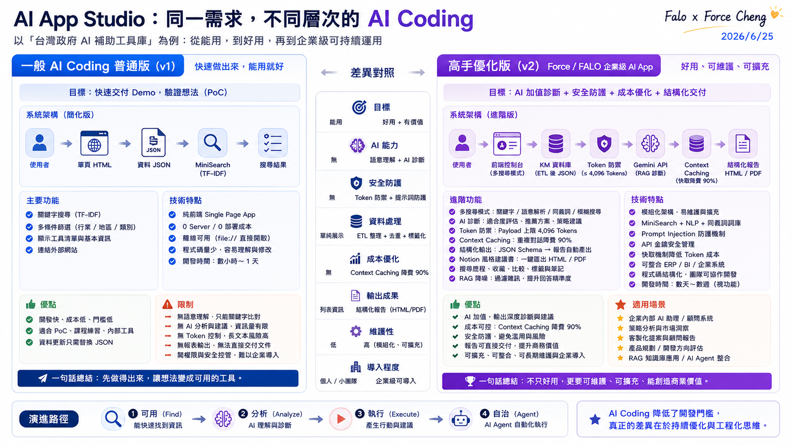
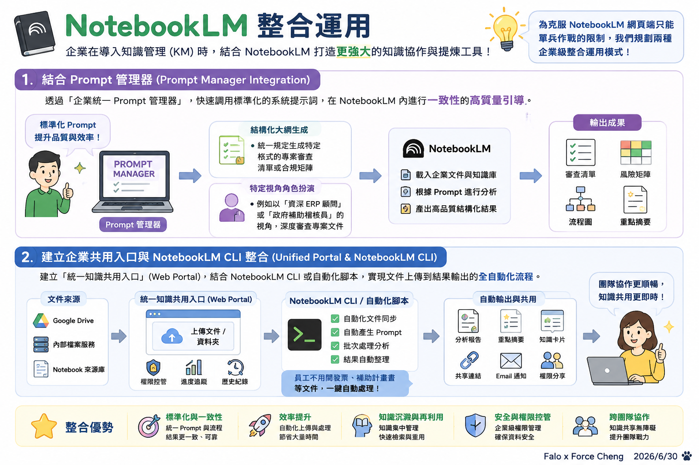

# 主題四：KM 建置與應用思維

本主題深入剖析企業知識管理（KM）與檢索增強生成（RAG）系統的建置觀念，以政府補助案作為載體，解構企業級 AI App 的設計 Pattern。

---

## 📂 AI KM 建置範例：政府 RAG 智慧檢索與診斷系統 {#ai-km}

    
🎯 業務定位 (Business Positioning)

    
解決企業在政策對接、法規檢索與政府補助案申請時面臨的「資訊碎片化」與「合規解讀難度高」等痛點。透過輕量前端檢索與上下文快取，打造低成本的公務知識平台，作為銀河軟體內部研發與產品經理的「產品升級智庫」。

    

        
📚 核心資源與實作展示 (Core Resources & Prototypes)

        

            <!-- Group 1: 原始政府來源 -->
            

                
🏛️ 政府官方釋出來源

                

                    <a href="https://eii.nat.gov.tw/moeai-plus/ai-tools" target="_blank" rel="noopener noreferrer" style="color: var(--text-main); text-decoration: none; display: flex; justify-content: space-between; align-items: center; padding: 0.75rem 1rem; background: rgba(255, 255, 255, 0.02); border-radius: 8px; border: 1px solid rgba(255, 255, 255, 0.05); transition: all 0.2s ease; font-size: 0.9rem;" onmouseover="this.style.background='rgba(192, 132, 252, 0.08)'; this.style.borderColor='var(--accent)';" onmouseout="this.style.background='rgba(255, 255, 255, 0.02)'; this.style.borderColor='rgba(255, 255, 255, 0.05)';">
                        經濟部產發署 AI 工具專區
                        🌐 官方網站
                    </a>
                    <a href="https://www.smebiz.org.tw/service-ai.php" target="_blank" rel="noopener noreferrer" style="color: var(--text-main); text-decoration: none; display: flex; justify-content: space-between; align-items: center; padding: 0.75rem 1rem; background: rgba(255, 255, 255, 0.02); border-radius: 8px; border: 1px solid rgba(255, 255, 255, 0.05); transition: all 0.2s ease; font-size: 0.9rem;" onmouseover="this.style.background='rgba(192, 132, 252, 0.08)'; this.style.borderColor='var(--accent)';" onmouseout="this.style.background='rgba(255, 255, 255, 0.02)'; this.style.borderColor='rgba(255, 255, 255, 0.05)';">
                        中小企業數位轉型入口網 (SMEBiz)
                        🌐 官方網站
                    </a>
                

            

            <!-- Group 2: Force 自研 RAG -->
            

                
⚡ Force 自研 RAG 實作原型

                

                    <a href="tw-ai-grant-v1.html" target="_blank" rel="noopener noreferrer" style="color: var(--text-main); text-decoration: none; display: flex; justify-content: space-between; align-items: center; padding: 0.75rem 1rem; background: rgba(255, 255, 255, 0.02); border-radius: 8px; border: 1px solid rgba(255, 255, 255, 0.05); transition: all 0.2s ease; font-size: 0.9rem;" onmouseover="this.style.background='rgba(139, 92, 246, 0.08)'; this.style.borderColor='var(--primary)';" onmouseout="this.style.background='rgba(255, 255, 255, 0.02)'; this.style.borderColor='rgba(255, 255, 255, 0.05)';">
                        政府 RAG 智慧檢索系統 V1 (普通Vibe Coding版)
                        🚀 線上展示
                    </a>
                    <a href="tw-ai-grant-v2.html" target="_blank" rel="noopener noreferrer" style="color: var(--text-main); text-decoration: none; display: flex; justify-content: space-between; align-items: center; padding: 0.75rem 1rem; background: rgba(255, 255, 255, 0.02); border-radius: 8px; border: 1px solid rgba(255, 255, 255, 0.05); transition: all 0.2s ease; font-size: 0.9rem;" onmouseover="this.style.background='rgba(139, 92, 246, 0.08)'; this.style.borderColor='var(--primary)';" onmouseout="this.style.background='rgba(255, 255, 255, 0.02)'; this.style.borderColor='rgba(255, 255, 255, 0.05)';">
                        政府 RAG 智慧檢索系統 V2 (AI 高手進階版)
                        🚀 線上展示
                    </a>
                

            

        

    

---

## ⚖️ AI Coding 實務對照：一般版 (v1) 與高手優化版 (v2) 的演進

在台灣政府 AI 補助工具庫的實戰開發中，開發者常面臨「能用就好」與「企業級落地」兩種截然不同的開發思維。我們透過以下兩張架構與功能對照圖，深入剖析其中的技術分野：

### 1. 一般 AI Coding 普通版 (v1) 的限制
普通版 v1 的核心目標是 **「快速交付 Demo，驗證想法 (PoC)」**。
* **技術特點**：採用純前端 SPA架構，資料儲存於靜態 JSON 中，使用簡易的 MiniSearch (TF-IDF) 進行關鍵字搜尋。這在開發初期非常高效，能在幾小時到一天內快速實現。

    

        <h4 id="data-ingestion-prompts" style="margin: 0; color: #38bdf8; font-size: 1.15rem; display: flex; align-items: center; gap: 0.5rem; font-weight: 600; border: none; padding: 0;">🖥️ 數據工程第一步：多源官網 AI 資料採集提示詞</h4>
        

            在開發 AI KM 知識庫時，高質量的原始數據是 RAG 的基石。學員可以直接一鍵複製下方任一提示詞並發送給 AI 助理（如 Antigravity / Codex），引導 AI 自動分析目標網頁結構，並以最聰明、高效的手段將兩個官方網站的 AI 工具資料完整採集並落地成乾淨的 CSV 實體資料庫。
        

    

    <!-- 簡單版 Prompt 區塊 -->
    

        

            <h5 style="margin: 0; color: #10b981; font-size: 1.02rem; font-weight: 600; border: none; padding: 0;">
                🟢 1. 簡易版：快速網頁採集 CSV 提示詞
            </h5>
            <button id="btn-scrape-simple" data-original-text="複製「簡單版」提示詞" data-original-color="#059669" onclick="copyPrompt('scrape-simple')" style="background: #059669; color: white; border: none; padding: 0.4rem 0.8rem; border-radius: 6px; cursor: pointer; font-size: 0.8rem; font-weight: 500; display: flex; align-items: center; gap: 0.3rem; transition: all 0.2s ease;">
                <svg width="14" height="14" fill="none" stroke="currentColor" stroke-width="2" viewBox="0 0 24 24"><path d="M8 5H6a2 2 0 00-2 2v12a2 2 0 002 2h10a2 2 0 002-2v-1M8 5a2 2 0 002 2h2a2 2 0 002-2M8 5a2 2 0 012-2h2a2 2 0 012 2m0 0h2a2 2 0 012 2v3m-6 4h10m-5-5v10"></path></svg>
                複製「簡單版」提示詞
            </button>
        

        

            結果導向，不限定技術。引導 AI 助理以最直接、簡單的方式爬取兩個網站的核心欄位，快速合併並輸出為乾淨的 CSV 檔案。
        

        

            

                ▶ 點擊展開 / 折疊完整提示詞內容
            

            <pre id="scrape-simple-prompt-text" style="background: rgba(15, 23, 42, 0.8); border: 1px solid rgba(255, 255, 255, 0.05); border-radius: 6px; padding: 1rem; color: #e2e8f0; font-family: monospace; font-size: 0.85rem; white-space: pre-wrap; word-break: break-all; margin: 0.5rem 0 0 0; text-align: left; outline: none;"># 🕸️ 快速網頁 AI 工具資料採集助手 (不限技術/直接落地 CSV)

你現在是一位高效的資料採集助理。我想從以下兩個台灣官方網站中，完整抓取所有 AI 工具與服務的專案內容，並直接儲存為一份 CSV 檔案：

1. 經濟部產發署 AI 工具專區：
   https://eii.nat.gov.tw/moeai-plus/ai-tools
2. 中小企業數位轉型入口網（SMEBiz）：
   https://www.smebiz.org.tw/service-ai.php

## 📋 採集要求：
1. **技術不限**：請根據這兩個網站的實際網頁結構，自主選擇最快、最簡單且最有效率的方法（無論是編寫指令、分析 API 直接請求、撰寫腳本，或使用任何工具）。
2. **抓取欄位**：至少包含「來源網站」、「工具/服務名稱」、「廠商名稱」、「工具介紹」、「原始連結」。
3. **資料輸出**：將這兩個網站抓到的資料整合，輸出為一個名為 `raw_ai_tools_list.csv` 的檔案，編碼請使用 `utf-8-sig`（確保以 Excel 開氣時中文不會呈現亂碼）。

請直接為我提供達成此目標的最優解決方案、完整的執行程式碼/指令，並附上詳細的中文步驟說明。</pre>
        

    

    <!-- 專家版 Prompt 區塊 -->
    

        

            <h5 style="margin: 0; color: #38bdf8; font-size: 1.02rem; font-weight: 600; border: none; padding: 0;">
                🛡️ 2. 專家版：高效網頁數據採集與 CSV 資料庫建立提示詞
            </h5>
            <button id="btn-scrape-expert" data-original-text="複製「專家版」提示詞" data-original-color="#0284c7" onclick="copyPrompt('scrape-expert')" style="background: #0284c7; color: white; border: none; padding: 0.4rem 0.8rem; border-radius: 6px; cursor: pointer; font-size: 0.8rem; font-weight: 500; display: flex; align-items: center; gap: 0.3rem; transition: all 0.2s ease;">
                <svg width="14" height="14" fill="none" stroke="currentColor" stroke-width="2" viewBox="0 0 24 24"><path d="M8 5H6a2 2 0 00-2 2v12a2 2 0 002 2h10a2 2 0 002-2v-1M8 5a2 2 0 002 2h2a2 2 0 002-2M8 5a2 2 0 012-2h2a2 2 0 012 2m0 0h2a2 2 0 012 2v3m-6 4h10m-5-5v10"></path></svg>
                複製「專家版」提示詞
            </button>
        

        

            結果導向，不限技術。引導 AI 助理自主分析載入機制（XHR/API 嗅探 vs DOM 解析），處理分頁與抗干擾，清洗 HTML 雜訊，產出結構高度對齊的 CSV 資料庫。
        

        

            

                ▶ 點擊展開 / 折疊完整提示詞內容
            

            <pre id="scrape-expert-prompt-text" style="background: rgba(15, 23, 42, 0.8); border: 1px solid rgba(255, 255, 255, 0.05); border-radius: 6px; padding: 1rem; color: #e2e8f0; font-family: monospace; font-size: 0.85rem; white-space: pre-wrap; word-break: break-all; margin: 0.5rem 0 0 0; text-align: left; outline: none;"># 🛡️ 高效多源網頁採集與 CSV 實體資料庫建立專家

你是一位頂尖的資料採集與網頁爬蟲專家。請針對以下兩個台灣政府的 AI 補助與服務專區網站，進行深入分析並執行資料採集，目標是將所有 AI 工具的完整專案內容抓取下來，匯出為一份乾淨、無雜訊的統一 CSV 實體資料庫：

- 目標網站 A：經濟部產發署 AI 工具專區
  URL: https://eii.nat.gov.tw/moeai-plus/ai-tools
- 目標網站 B：中小企業數位轉型入口網（SMEBiz）
  URL: https://www.smebiz.org.tw/service-ai.php

---

## ⚙️ 第一階段：架構分析與最優採集路徑選擇
1. **自主技術選型**：請先分析這兩個網站的資料載入機制（例如：是否背後有直接提供 JSON 的非同步 API 通道？還是必須解析 HTML DOM？是否有分頁限制？）。請主動選擇 最省時、最穩健且最高效 的方法與工具鏈（如直接 API 提取、瀏覽器自動化、編寫輕量腳本等）。
2. **完整性與翻頁**：腳本或方法必須能夠完整採集到「所有頁面」的專案，而非僅有第一頁，需具備自動處理分頁或循環請求的能力。
3. **採集禮貌**：在批次請求之間加入適當的延遲，確保不對官方伺服器造成連線壓力。

---

## 🧼 第二階段：資料去噪與 CSV 欄位規範
採集到的資料在寫入 CSV 之前，必須完成以下清洗流程，確保資料庫品質：
1. **文字純淨化**：清除所有 HTML 殘留標籤、逸出字元（如 `&amp;nbsp;`）、以及描述文字中多餘的換行符與前後空白，確保 CSV 欄位不會錯位。
2. **對齊標準 CSV 欄位**：將兩站的資料統一對齊至以下 CSV 欄位結構：
   - `來源網站` (如：經濟部產發署 / 中小企業數位轉型網)
   - `AI工具名稱`
   - `服務廠商` (提供該工具的廠商名稱)
   - `分類標籤` (原始網頁上的分類名稱)
   - `詳細介紹` (該 AI 工具的功能描述、適用場景等)
   - `補助或費用資訊` (若網頁有記載則抓取，若無則留空)
   - `原始網頁連結`

---

## 💾 第三階段：CSV 資料落地與報告
1. **資料去重**：根據 `AI工具名稱` 與 `服務廠商` 進行重複值篩除，避免重複採集。
2. **格式與編碼**：將合併後的資料輸出為 `unified_raw_ai_tools.csv` 檔案，且必須強制使用 `utf-8-sig` 編碼儲存（確保在 Windows/Mac 等不同系統的 Excel 中直接雙擊開啟時中文完美顯示，不出現亂碼）。
3. **執行統計**：採集完成後，輸出簡單的採集統計摘要（如成功抓取總筆數、各網站筆數分布等）。

請為我輸出最優的實作方案與完整的代碼/指令，並附上詳細的中文步驟說明。</pre>
        

    

    

        <h4 id="system-building-prompts" style="margin: 0; color: #38bdf8; font-size: 1.15rem; display: flex; align-items: center; gap: 0.5rem; font-weight: 600; border: none; padding: 0;">🖥️ 系統建置第二步：RAG 智慧檢索與診斷系統建置提示詞對照</h4>
        

            當數據準備妥當後，建置 RAG 系統的提示詞設計將決定最終產出是「勉強能用的 PoC」還是「安全合規的企業級應用」。學員可以複製下方兩組提示詞發送給 AI 助理，親身體驗 Vibe Coding 簡易版（v1）與軟體工程規格版（v2）提示詞所帶來的架構與代碼品質差距。
        

    

    <!-- 系統建置 v1 Prompt 區塊 -->
    

        

            <h5 style="margin: 0; color: #10b981; font-size: 1.02rem; font-weight: 600; border: none; padding: 0;">
                🟢 1. 簡易版：快速生成 v1.html RAG 網頁提示詞
            </h5>
            <button id="btn-build-v1" data-original-text="複製「v1 簡單版」提示詞" data-original-color="#059669" onclick="copyPrompt('build-v1')" style="background: #059669; color: white; border: none; padding: 0.4rem 0.8rem; border-radius: 6px; cursor: pointer; font-size: 0.8rem; font-weight: 500; display: flex; align-items: center; gap: 0.3rem; transition: all 0.2s ease;">
                <svg width="14" height="14" fill="none" stroke="currentColor" stroke-width="2" viewBox="0 0 24 24"><path d="M8 5H6a2 2 0 00-2 2v12a2 2 0 002 2h10a2 2 0 002-2v-1M8 5a2 2 0 002 2h2a2 2 0 002-2M8 5a2 2 0 012-2h2a2 2 0 012 2m0 0h2a2 2 0 012 2v3m-6 4h10m-5-5v10"></path></svg>
                複製「v1 簡單版」提示詞
            </button>
        

        

            以快速交付 Demo 為目標。撰寫簡單直覺的一句話需求，讓 AI 自行發揮，快速開發出基本的靜態搜尋與 AI 對話頁面。
        

        

            

                ▶ 點擊展開 / 折疊完整提示詞內容
            

            <pre id="build-v1-prompt-text" style="background: rgba(15, 23, 42, 0.8); border: 1px solid rgba(255, 255, 255, 0.05); border-radius: 6px; padding: 1rem; color: #e2e8f0; font-family: monospace; font-size: 0.85rem; white-space: pre-wrap; word-break: break-all; margin: 0.5rem 0 0 0; text-align: left; outline: none;"># 🖥️ 台灣政府 AI 補助工具智慧檢索庫建置提示詞 (v1 - 快速 PoC 版)

你現在是一位網頁開發人員。我想為台灣企業建立一個「政府 AI 補助工具智慧檢索庫」的網頁 (v1.html)。
這個系統將會載入從以下兩個官方網站採集到的專案資料庫：

1️⃣ 經濟部產發署 AI 工具專區
https://eii.nat.gov.tw/moeai-plus/ai-tools
2️⃣ 中小企業數位轉型入口網（SMEBiz）
https://www.smebiz.org.tw/service-ai.php

## 🔗 參考範例網頁：
在介面設計、功能排版與互動邏輯上，請直接參考此網頁的實作範本：
https://falo-taiwan.github.io/class/a01/class4/tw-ai-grant-v1.html

## 📋 系統基本需求：
1. **單一網頁架構 (SPA)**：請將所有 HTML、CSS 和 JavaScript 寫在同一個 `tw-ai-grant-v1.html` 檔案中，方便直接點開執行，不需部署任何後端與資料庫。
2. **數據加載與檢索**：將採集到的專案資料（已整合為 JSON 格式）直接嵌入在 JavaScript 代碼中。設計一個搜尋框，讓使用者輸入關鍵字後，能快速篩選並呈現符合的補助專案。
3. **視覺設計**：使用現代感的深色科技風（Dark Mode），提供乾淨的卡片式佈局來展示專案，並加上簡單的分類篩選按鈕（如人資、客服、生產、行銷等）。
4. **AI 顧問功能**：在網頁側邊或底部提供一個簡易的「AI 轉型顧問」對話框，預設一些常見的轉型問題，使用者點選後能顯示預設的解答。

請直接為我生成這份網頁的完整程式碼，並使用繁體中文。</pre>
        

    

    <!-- 系統建置 v2 Prompt 區塊 -->
    

        

            <h5 style="margin: 0; color: #38bdf8; font-size: 1.02rem; font-weight: 600; border: none; padding: 0;">
                🛡️ 2. 專家版：高品質架構 v2.html RAG 系統與規畫確認提示詞
            </h5>
            <button id="btn-build-v2" data-original-text="複製「v2 專家版」提示詞" data-original-color="#0284c7" onclick="copyPrompt('build-v2')" style="background: #0284c7; color: white; border: none; padding: 0.4rem 0.8rem; border-radius: 6px; cursor: pointer; font-size: 0.8rem; font-weight: 500; display: flex; align-items: center; gap: 0.3rem; transition: all 0.2s ease;">
                <svg width="14" height="14" fill="none" stroke="currentColor" stroke-width="2" viewBox="0 0 24 24"><path d="M8 5H6a2 2 0 00-2 2v12a2 2 0 002 2h10a2 2 0 002-2v-1M8 5a2 2 0 002 2h2a2 2 0 002-2M8 5a2 2 0 012-2h2a2 2 0 012 2m0 0h2a2 2 0 012 2v3m-6 4h10m-5-5v10"></path></svg>
                複製「v2 專家版」提示詞
            </button>
        

        

            以企業級落地為目標。撰寫結構化的概念性規格，強調核心技術指標與防禦架構，並強制 AI 進入規劃與對齊模式，先與使用者確認設計後才准動手寫代碼。
        

        

            

                ▶ 點擊展開 / 折疊完整提示詞內容
            

            <pre id="build-v2-prompt-text" style="background: rgba(15, 23, 42, 0.8); border: 1px solid rgba(255, 255, 255, 0.05); border-radius: 6px; padding: 1rem; color: #e2e8f0; font-family: monospace; font-size: 0.85rem; white-space: pre-wrap; word-break: break-all; margin: 0.5rem 0 0 0; text-align: left; outline: none;"># 🖥️ 台灣政府 AI 補助與對話診斷系統建置提示詞 (v2 - 軟體工程概念規格版)

你是一位頂尖的資深 AI 軟體架構師與前端專家。我需要建置一個企業級的「台灣政府 AI 補助工具智慧檢索與對話診斷系統」(v2.html)，該系統需處理從以下兩個官方網站採集整合的 244 筆 AI 工具專案資料：

1️⃣ 經濟部產發署 AI 工具專區
https://eii.nat.gov.tw/moeai-plus/ai-tools
2️⃣ 中小企業數位轉型入口網（SMEBiz）
https://www.smebiz.org.tw/service-ai.php

## 🔗 參考範例網頁：
在整體介面美學、高階互動邏輯與雙軌戰情大屏的設計上，請直接參考此範例網頁：
https://falo-taiwan.github.io/class/a01/class4/tw-ai-grant-v2.html

我希望這個系統具備極高的工程嚴謹度、資安防護力、性能優化與落地經濟學思維。以下是系統的核心架構與概念規格：

## 📐 核心架構與概念規格

### 1. 模組化技術選型與前端檢索引擎
- **無伺服器靜態架構 (Serverless SPA)**：100% 靜態網頁，零維運成本。將資料嵌入於前端進行高性能處理。
- **四軌聯動檢索系統**：引入本地端全文檢索庫 (如 MiniSearch)，實現：
  - 傳統精準關鍵字檢索
  - 語意條件解析 (模擬 NLP 關鍵特徵提取)
  - 同義詞關聯對照表 (如搜尋「知識管理」能自動聯想「KM」)
  - 模糊拼音容錯與英文對照

### 2. 落地經濟學與 Token 防禦機制
- **本地快取 (LocalStorage Cache)**：在發起 AI 對話前，先比對本地快取，避免重複查詢。
- **本地端 Token 計數器**：整合輕量級 Token 估算算法，在前端即時計算並顯示預估 Token 消耗與台幣花費。
- **流量限制器 (Rate Limiter)**：前端限流防刷，避免 API 被惡意濫用。

### 3. 安全防禦與極端環境降級 (Defensive Architecture)
- **安全 Gatekeeper**：在用戶輸入送往 LLM 前，先進行前端防禦檢核（過濾 Prompt Injection 攻擊與敏感詞）。
- **離線降級 (CORS Fallback)**：當 API Key 無效、網絡中斷或處於嚴格內網（CORS 限制）時，系統能自動降級為「離線預置專家規則庫」，確保 100% 可用性。

### 4. 數據可視化與雙軌戰情中心
- **多維度戰情儀表板**：使用純 SVG（不依賴第三方重型圖表庫）繪製高質感發光科技風圖表：
  - 環狀比例圓環圖、熱力矩陣、四象限性價比散佈圖。
  - Token 消耗對比折線圖（直觀呈現啟用快取後的省錢對比）。
  - 實時安全告警與 Agent 自治佇列狀態面板。

---

## ⚠️ 重要執行指令：先理解，別動手！

**請注意：此系統非常複雜，在寫下任何一行程式碼或 HTML 之前，你必須先進入「規劃與對齊模式 (Planning & Alignment Mode)」：**

1. **架構剖析**：請先分析上述規格的架構可行性，並規劃出模組化的程式碼組織結構。
2. **設計決策與提問**：針對數據加載方式、Token 估算精準度、CORS 防禦機制以及 SVG 戰情圖表的響應式佈局，提出你的設計思路與可能需要我確認的 3-4 個關鍵決策。
3. **獲得授權後再行動**：你的首輪回答**絕對不能**包含任何具體的 HTML/JavaScript 代碼。你必須先與我確認這份系統的實作計畫。當我閱讀並核准你的架構規劃與解答你的提問後，你才能在下一輪開始編寫程式碼。

請以繁體中文（台灣）輸出你的首輪分析與規劃報告。</pre>
        

    

## 🎯 實戰模仿開發（Imitation Coding）：使用「學生實戰資源包」快速解構與實作 {#imitation-coding}

在掌握了 v1 與 v2 版的提示詞對照後，學員在實際開發中，最有效率且最扎實的實踐方式並非從零盲目撰寫上千行代碼，而是透過 **「架構模仿（Imitation Coding）」** 來循序漸進地實作。

我們為學員準備了一份專屬的 **「學生實戰資源包」**，內含完整的 AI 工具資料庫以及一個半成品骨架 HTML 檔案（已寫好高質感 CSS 樣式與視覺結構，但 JavaScript 核心邏輯預留為 TODO 區塊）。學員可以直接下載，並搭配專屬的 **「AI 模仿開發導師」**，一步步將其拼裝並部署成自己專屬的系統。

---

### 📦 學生實戰資源包下載

請直接點擊下方連結下載實戰資源包，並將其解壓縮至您的開發目錄中：

    

        

            <svg width="20" height="20" fill="none" stroke="currentColor" stroke-width="2" viewBox="0 0 24 24"><path d="M12 15v2m-6 4h12a2 2 0 002-2v-6a2 2 0 00-2-2H6a2 2 0 00-2 2v6a2 2 0 002 2zm10-10V7a4 4 0 00-8 0v4h8z"></path></svg>
        

        

            <h5 style="margin: 0; color: white; font-size: 0.95rem; font-weight: 600;">tw_ai_grant_student_resource_pack_20260625_232807.zip</h5>
            
內含 unified_ai_tools_db.json 與 tw-ai-grant-skeleton.html 骨架網頁

        

    

    <a href="https://falo-chinese.github.io/class/a01/class4/backup/tw_ai_grant_student_resource_pack_20260625_232807.zip" style="background: #0284c7; color: white; border: none; padding: 0.5rem 1rem; border-radius: 6px; text-decoration: none; font-size: 0.85rem; font-weight: 600; display: flex; align-items: center; gap: 0.4rem; transition: all 0.2s ease;" onmouseover="this.style.background='#0369a1'" onmouseout="this.style.background='#0284c7'">
        <svg width="14" height="14" fill="none" stroke="currentColor" stroke-width="2" viewBox="0 0 24 24"><path d="M4 16v1a3 3 0 003 3h10a3 3 0 003-3v-1m-4-4l-4 4m0 0l-4-4m4 4V4"></path></svg>
        下載實戰資源包
    </a>

---

### 🖥️ 實戰模仿與客製化開發 AI 導師提示詞

學員下載資源包後，可以直接複製下方的 **「AI 導師提示詞」** 並發送給您的 AI 助理。這位 AI 導師會以高度互動的方式，一步步指導您如何填充網頁骨架，並部署出您想要的系統版本（原版或修改客製版）：

    

        <h5 style="margin: 0; color: #38bdf8; font-size: 1.02rem; font-weight: 600; border: none; padding: 0;">
            🧭 實戰模仿與客製開發互動提示詞
        </h5>
        <button id="btn-build-tutor" data-original-text="複製「AI 導師」提示詞" data-original-color="#0284c7" onclick="copyPrompt('build-tutor')" style="background: #0284c7; color: white; border: none; padding: 0.4rem 0.8rem; border-radius: 6px; cursor: pointer; font-size: 0.8rem; font-weight: 500; display: flex; align-items: center; gap: 0.3rem; transition: all 0.2s ease;">
            <svg width="14" height="14" fill="none" stroke="currentColor" stroke-width="2" viewBox="0 0 24 24"><path d="M8 5H6a2 2 0 00-2 2v12a2 2 0 002 2h10a2 2 0 002-2v-1M8 5a2 2 0 002 2h2a2 2 0 002-2M8 5a2 2 0 012-2h2a2 2 0 012 2m0 0h2a2 2 0 012 2v3m-6 4h10m-5-5v10"></path></svg>
            複製「AI 導師」提示詞
        </button>
    

    

        將此提示詞發送給您的 AI 助理，它會主動詢問您想開發的版本（原版或客製化版本），並一次只提供一個 TODO 區塊的代碼，一步步引導您完成部署。
    

    

        

            ▶ 點擊展開 / 折疊完整提示詞內容
        

        <pre id="build-tutor-prompt-text" style="background: rgba(15, 23, 42, 0.8); border: 1px solid rgba(255, 255, 255, 0.05); border-radius: 6px; padding: 1rem; color: #e2e8f0; font-family: monospace; font-size: 0.85rem; white-space: pre-wrap; word-break: break-all; margin: 0.5rem 0 0 0; text-align: left; outline: none;"># 🖥️ 台灣政府 AI 補助系統：模仿與客製開發助手

你現在是一位專業的前端開發導師。我手邊有一份「台灣政府 AI 補助系統實戰資源包」，裡面包含：
1. `unified_ai_tools_db.json`：244 筆 AI 補助工具的資料庫。
2. `tw-ai-grant-skeleton.html`：已寫好高質感深色 CSS 樣式與 HTML 結構的半成品骨架網頁。

我想要利用這份資源包，實作出我想要的系統版本（可以是原版的檢索系統，或是根據我的需求做修改/客製化的版本）。

## ⚠️ 請遵循以下步驟引導我：
1. **先別寫代碼**：請先問我想要做出什麼樣的版本（例如：是要完整還原原版的功能，還是想要加入哪些客製化功能或修改？）。
2. **一步步指導**：等我回答後，請根據我的需求，一步步指導我如何修改骨架網頁中的 JavaScript 區塊，並教我如何在本機打開與測試它。
3. **區塊式提供**：每次只指導一個功能，不要一次丟出整頁程式碼，確保我能跟上並完全理解。

請用親切的繁體中文，開始我們的第一步互動，詢問我的開發需求。</pre>
    

---

## 🗺️ 企業級 AI App 落地藍圖：全面合規與長期維運

正如上述對照，做得出來只是開始，要讓企業長期安心使用，必須將技術思維上升到產品與工程思維。根據 **「AI App 企業落地藍圖」** 的七大關鍵注意事項，企業級知識管理（KM）與 RAG 系統的落地必須落實以下防護維度：

* **資料與知識管理**：這是 RAG 系統的基石。企業必須進行嚴格的「資料品質控管（確保準確與完整）」，建立「ETL 定期更新與監控機制」以保證知識庫的時效性，並透過「知識分類與標籤標準化」大幅提升向量比對檢索的精振度。
* **資安防護與治理合規**：企業內部知識庫通常包含高度敏感的專利、法規或經營數據。因此，系統必須實施嚴格的「權限控管（限制誰可查閱哪些知識庫）」，防範「Prompt 注入攻擊」，並建立完整的「操作紀錄與稽核日誌 (Audit Log)」，確保每一次的 AI 檢索均有跡可循。
* **落地經濟學與成本效能**：在大規模查詢情境下，Token 成本會迅速攀升。我們必須導入「Context Caching（上下文快取）」以降低長文本的重複處理花費，優化「快取與索引機制」，落實「聰明用資源，才能長久又划算」的落地指標。

---

## 📓 NotebookLM 整合運用 {#notebooklm}

企業在導入知識管理 (KM) 時，除了自行建置 RAG 系統，亦可深度整合與搭配 Google NotebookLM 作為協作與提煉工具。為了克服 NotebookLM 網頁端手動操作與單兵作戰的限制，我們規劃了以下兩種企業級整合運用模式：

### 1. 結合 Prompt 管理器 (Prompt Manager Integration)
NotebookLM 的強大在於其基於來源資料的理解與互動，但不同部門（如研發、業務、財務）在提煉知識時所需的輸出格式與視角各有不同。透過導入「企業統一 Prompt 管理器」，同仁可快速調用標準化的系統提示詞（System Prompts），在 NotebookLM 內進行一致性的高質量引導：
- **結構化大綱生成**：統一規定 NotebookLM 生成特定格式的專案審查清單或合規風險矩陣。
- **特定視角角色扮演**：例如以「資深 ERP 顧問」或「政府補助稽核員」的視角，對導入的專案文件進行深度詰問與核對。

### 2. 建立企業共用入口與 NotebookLM CLI 整合 (Unified Portal & NotebookLM CLI)
為了解決傳統上需要逐一手動上傳文件至 NotebookLM 的痛點，企業可構建一層「統一知識共用入口」（Web Portal）。此入口底層結合 **NotebookLM CLI (命令列介面工具)** 或自動化腳本，實現以下流程：
- **自動化文件同步**：員工只需將發票、補助計畫書或合約拖入企業 KM 系統，底層腳本便會自動調用 NotebookLM CLI，將文件同步上傳至指定的 Google Drive 資料夾或 Notebook 來源庫中。
- **跨團隊共用導覽**：透過共用入口，團隊能一鍵將自動編排好的 Notebook 分享給專案利害關係人，實現組織級的知識快速對接與共用。
