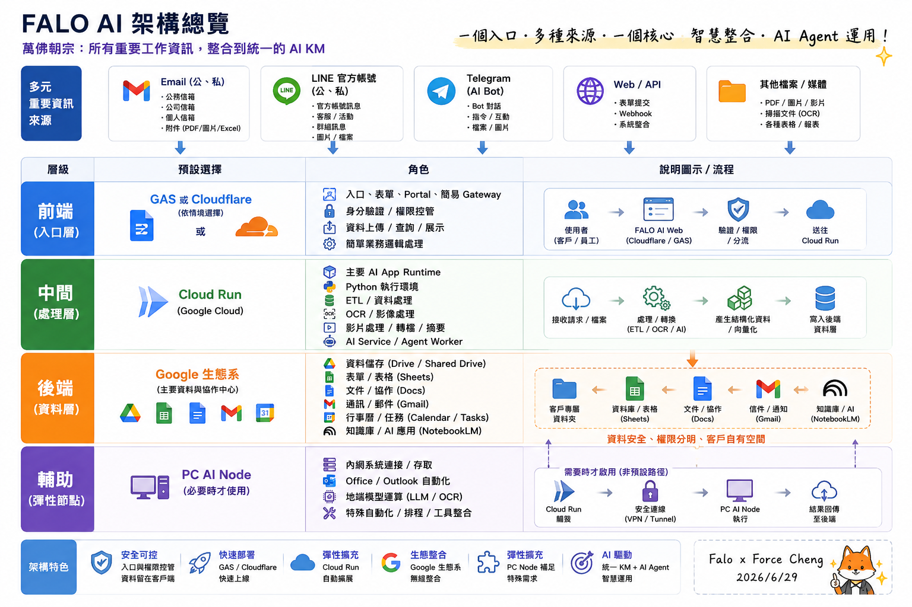
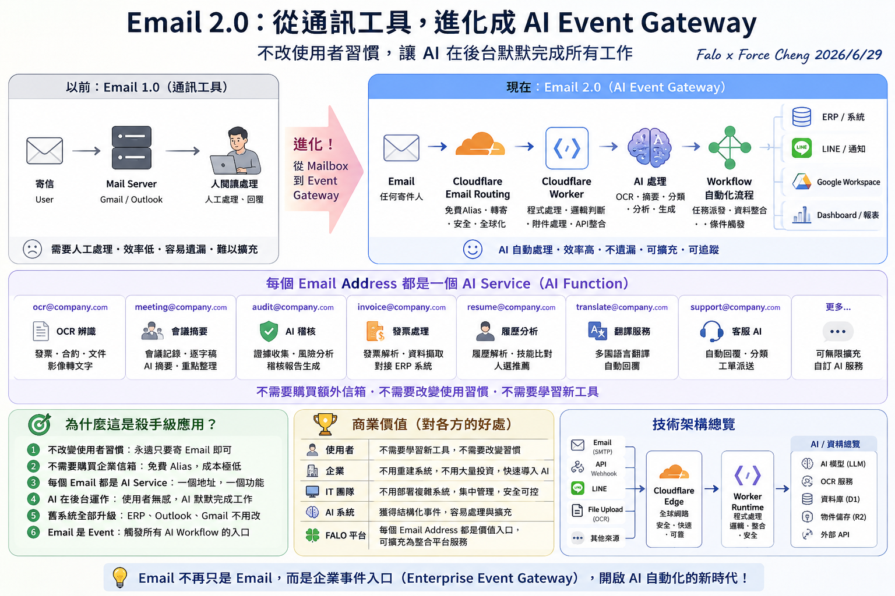

# 主題二：AI App 專案腦力激盪

本主題收錄完整的「AI APP Studio 工作坊」實戰框架，引導同仁從痛點出發，共創銀河 ERP × FORCE AI App Store 的產品藍圖。本專案將 AI App 創意與需求池物理性地劃分為三大核心業務方向，並以折疊面板形式呈現極具深度與前瞻性的技術細節，供同仁進行腦力激盪與系統設計。

---

## 🛠️ FALO AI 系統開發核心工具與技術架構

在進行 AI App 的設計與腦力激盪前，同仁應先對我們系統開發所**主要聚焦的工具與核心架構**有清晰的認識。我們完全基於國際大廠（Google 生態系與 Cloudflare）的企業級基礎設施進行開發，讓 AI 默默在後台默默完成所有工作：

> [!NOTE]
> **主要聚焦工具與設計精神**：
> 1. **前端與入口層**：主要聚焦於 **Google Apps Script (GAS)** 與 **Cloudflare Workers / Email Routing**。利用 Cloudflare 作為全球 Edge 節點，結合 Email 2.0 概念（將每個 Email Address 映射為專屬 AI Function，如 `ocr@`、`meeting@`），在完全不改變使用者習慣的前提下，將郵件收發轉化為啟動後台 AI 工作流的事件入口。
> 2. **處理層 (Middleware)**：主要聚焦於 **Google Cloud Run**。作為 AI 運行的主要 Runtime，提供 Python 執行環境，負責高密度的 ETL 資料管線、OCR 辨識與影片分析。
> 3. **資料與後端層**：主要聚焦於 **Google Workspace (Drive, Sheets, Docs, Gmail, NotebookLM)**。使客戶資料完整留存在自有的安全雲端空間中，符合 Zero Trust 企業安全與合規稽核。

---

## 🎯 銀河 ERP × FORCE AI App Store 三大業務方向產品藍圖

為引導同仁將日常工作的「痛點」轉化為「標準化 AI 產品」，我們規劃了代表未來升級方向的三大核心 AI App 業務方向。以下為各方向的產品定位、架構細節與具體用途：

### 方向 A：AI KM 政府與企業知識庫平台 {#direction-a}

    
🎯 業務定位 (Business Positioning)

    
解決企業在政策對接、法規檢索與政府補助案申請時面臨的「資訊碎片化」與「合規解讀難度高」等痛點。透過輕量前端檢索與上下文快取，打造低成本的公務知識平台，作為銀河軟體內部研發與產品經理的「產品升級智庫」。

    

        
📚 核心資源與實作展示 (Core Resources & Prototypes)

        

            <!-- Group 1: 原始政府來源 -->
            

                
🏛️ 政府官方釋出來源

                

                    <a href="https://eii.nat.gov.tw/moeai-plus/ai-tools" target="_blank" rel="noopener noreferrer" style="color: var(--text-main); text-decoration: none; display: flex; justify-content: space-between; align-items: center; padding: 0.75rem 1rem; background: rgba(255, 255, 255, 0.02); border-radius: 8px; border: 1px solid rgba(255, 255, 255, 0.05); transition: all 0.2s ease; font-size: 0.9rem;" onmouseover="this.style.background='rgba(192, 132, 252, 0.08)'; this.style.borderColor='var(--accent)';" onmouseout="this.style.background='rgba(255, 255, 255, 0.02)'; this.style.borderColor='rgba(255, 255, 255, 0.05)';">
                        經濟部產發署 AI 工具專區
                        🌐 官方網站
                    </a>
                    <a href="https://www.smebiz.org.tw/service-ai.php" target="_blank" rel="noopener noreferrer" style="color: var(--text-main); text-decoration: none; display: flex; justify-content: space-between; align-items: center; padding: 0.75rem 1rem; background: rgba(255, 255, 255, 0.02); border-radius: 8px; border: 1px solid rgba(255, 255, 255, 0.05); transition: all 0.2s ease; font-size: 0.9rem;" onmouseover="this.style.background='rgba(192, 132, 252, 0.08)'; this.style.borderColor='var(--accent)';" onmouseout="this.style.background='rgba(255, 255, 255, 0.02)'; this.style.borderColor='rgba(255, 255, 255, 0.05)';">
                        中小企業數位轉型入口網 (SMEBiz)
                        🌐 官方網站
                    </a>
                

            

            <!-- Group 2: Force 自研 RAG -->
            

                
⚡ Force 自研 RAG 實作原型

                

                    <a href="https://falo-taiwan.github.io/class/a01/class4/tw-ai-grant-v1.html" target="_blank" rel="noopener noreferrer" style="color: var(--text-main); text-decoration: none; display: flex; justify-content: space-between; align-items: center; padding: 0.75rem 1rem; background: rgba(255, 255, 255, 0.02); border-radius: 8px; border: 1px solid rgba(255, 255, 255, 0.05); transition: all 0.2s ease; font-size: 0.9rem;" onmouseover="this.style.background='rgba(139, 92, 246, 0.08)'; this.style.borderColor='var(--primary)';" onmouseout="this.style.background='rgba(255, 255, 255, 0.02)'; this.style.borderColor='rgba(255, 255, 255, 0.05)';">
                        政府 RAG 智慧檢索系統 V1 (普通Vibe Coding版)
                        🚀 線上展示
                    </a>
                    <a href="https://falo-taiwan.github.io/class/a01/class4/tw-ai-grant-v2.html" target="_blank" rel="noopener noreferrer" style="color: var(--text-main); text-decoration: none; display: flex; justify-content: space-between; align-items: center; padding: 0.75rem 1rem; background: rgba(255, 255, 255, 0.02); border-radius: 8px; border: 1px solid rgba(255, 255, 255, 0.05); transition: all 0.2s ease; font-size: 0.9rem;" onmouseover="this.style.background='rgba(139, 92, 246, 0.08)'; this.style.borderColor='var(--primary)';" onmouseout="this.style.background='rgba(255, 255, 255, 0.02)'; this.style.borderColor='rgba(255, 255, 255, 0.05)';">
                        政府 RAG 智慧檢索系統 V2 (AI 高手進階版)
                        🚀 線上展示
                    </a>
                

            

        

    

<b>展開檢視方向 A：1. 雙平台 244 款 AI 工具與轉型解決方案標竿檢索器</b>

#### 1. 雙平台 244 款 AI 工具與轉型解決方案標竿檢索器 (AI Tools & Digital Transformation Retriever)
*   **核心功能**：
    *   **深度檢索機制**：整合「經濟部產發署 AI 工具專區」與「SMEBiz 中小企業數位轉型入口網」共 244 筆台灣本土「AI 工具」、「數位轉型解決方案」、「轉型案例」與「服務商」資料庫，建立高維度的語意向量索引。
    *   **標竿對齊分析**：當產品經理或研發人員輸入特定產業或業務場景（如：製造業排程、零售業客服）時，系統自動比對並推薦市場上最成熟的 AI 工具與轉型方案，分析其核心功能、導入路徑與應用成效，作為自身產品升級的標竿。
*   **技術架構與落地方案**：
    *   **輕量化本地檢索**：將雙平台共 244 款 AI 工具與方案資料庫以靜態 JSON 形式直接內嵌於前端，並引入輕量化 JavaScript 全文檢索程式庫（MiniSearch）於瀏覽器記憶體內建立索引，提供即時的模糊搜尋與條件過濾，完全無需部署後端向量資料庫（如 Qdrant 或 Milvus）。
    *   **無伺服器瀏覽器端 RAG**：採用 Serverless / Client-side RAG（檢索增強生成）架構。系統採取 「先篩選、後分析」 的優化工作流：在用戶發起 AI 對話時，瀏覽器並不發送全量資料，而是僅將經由檢索與過濾篩選後的精確工具子集作為 Context，搭配用戶本地設定的 Gemini API Key（呼叫 `gemini-3.1-flash-lite` 雲端模型，亦支援地端 Ollama 模型）傳送給大模型。此設計能 極大化降低 Token 消耗量、成倍節省 API 運作成本，並大幅提升回答的精準度與響應效益，達成零後端架構的極致節費落地。
*   **應用場景**：
    *   產品經理在設計 ERP 的「智慧預測」功能時，一鍵查詢產發署 AI 工具專區及 SMEBiz 中，所有已上架的製造業或零售業預測型 AI 解決方案，分析其功能規格與導入模式，精準進行產品定位與升級規劃。

<b>展開檢視方向 A：2. 藍海市場功能缺口與創新商機探測器</b>

#### 2. 藍海市場功能缺口與創新商機探測器 (Blue Ocean Gap & Innovation Detector)
*   **核心功能**：
    *   **市場缺口矩陣分析**：將 244 款現有 AI 工具與轉型方案的特徵進行多維度矩陣標註，自動分析並找出目前中小企業「尚未被滿足的 AI 轉型痛點」與「技術空白區」。
    *   **生成式創新提案**：基於發現的市場盲點，結合 LLM 自動進行腦力激盪，產出具有獨特競爭壁壘的全新 AI 轉型工具規格書與商業模式設計。
*   **技術架構與落地方案**：
    *   **四維複合式檢索定位**：利用系統內建的**四種搜尋檢索模式（關鍵字檢索、語意條件解析、同義詞關聯、模糊相關度排序）**，讓產品經理能夠多維度、無死角地檢索與審計 244 款現有工具資料庫。透過分析低匹配度或「零結果」的高頻查詢，精準鎖定市場上的功能缺口與未滿足痛點。
    *   **生成式 AI 創新提案**：針對偵測到的市場空白區，調用內置的 Gemini 智慧轉型顧問（基於 `gemini-3.1-flash-lite` 雲端模型或地端 Ollama 模型），進行多角色腦力激盪與概念組合，為未解決的痛點自動生成產品規格書與 PRD（產品需求文件）草案。
*   **應用場景**：
    *   分析發現雙平台中針對中小企業的「低門檻、免設定 AI 財務分析工具」仍屬空白，系統立即偵測到此轉型缺口，並自動生成「自動化生成式財務報表與對帳模組」的產品開發案，作為銀河 ERP SaaS 智慧增強的獨家研發方向。
*   **實作與視覺展示**：
    *   本探測器所使用的分析與篩選看板，在 [主題三：ETL 實務案例分享](topic3_etl_cases.md#etl-load) 中有高保真的實作展示（**企業級 AI 雙軌戰情中心**）。其中的 **「AI 標準化分類佔比圓環圖 (Donut Chart)」**、**「適用產業熱力矩陣 (Heatmap)」** 以及 **「預算期程性價比象限散佈圖 (Quadrant Scatter Plot)」** 等核心圖表元件，即是此系統用來動態標註特徵、識別產業熱度與劃分高性價比「輕量嘗鮮區/SaaS區」等藍海市場缺口的運維主面板。

---

### 方向 B：銀河 ERP 企業配套軟體 (SaaS 智慧增強) {#direction-b}

*   **業務定位**：作為 ERP 廠商（銀河軟體），將 AI 技術無縫融入現有 ERP 作業流程中，為企業客戶提供高價值的 SaaS 智慧增值配套，解決複雜數據輸入、合規稽核、生產排程與決策輔助 the 痛點。

<b>展開檢視方向 B：9 大黃金核心模組詳細規格</b>

#### 1. 智慧供應鏈需求預測與採購調配模組 (Demand Forecasting & Purchasing)
*   **用途與價值**：整合歷史銷售、外部市場趨勢與地緣政治數據，預測未來 3 至 6 個月的物料需求，自動產出最佳採購建議，最大化降低庫存積壓資金。
*   **技術實現**：結合時間序列模型 (如 PatchTST/TimesNet) 與大語言模型，處理結構化庫存報表與非結構化的市場新聞分析，實現高精度的混合預測。

#### 2. 多模態視覺智慧入庫與庫存盤點模組 (Multimodal Vision Warehousing)
*   **用途與價值**：倉管人員僅需使用行動裝置拍照或透過廠區監控攝影機，系統即可自動識別入庫物料的種類、數量與外觀缺陷，並自動將數據填入 ERP 庫存系統。
*   **技術實現**：採用邊緣端 Vision-Language Model (VLM) 進行物料特徵萃取與物件偵測 (Object Detection)，並透過 RESTful API 與 ERP 進銷存模組即時同步。

#### 3. 自動化生成式財務報表與異常對帳模組 (Generative Financial Reconciliation)
*   **用途與價值**：自動串接多間銀行的對帳單、發票與銷貨單，智慧比對會計科目，自動完成月結與沖帳，並生成符合審計標準的異常對帳分析報告。
*   **技術實現**：運用 OCR 與多代理人 (Multi-Agent) 架構，一邊由財務代理人解析對帳單，另一邊由合規代理人進行三方對照，校正大模型輸出的噪聲數據。

#### 4. 智慧合約審查與採購履約風控模組 (Smart Contract & Compliance Risk Control)
*   **用途與價值**：自動審查上下游廠商合約，精準標註出遲延交付、罰則、排他條款等潛在法律風險，並在履約階段自動監控各個里程碑，主動警示潛在違約風險。
*   **技術實現**：使用專門微調的 Legal-LLM，搭配合約範本的知識庫，進行條款層級 (Clause-level) 的風險評級與合規性分析。

#### 5. 全球跨境貿易合規與自動關稅稅則計算模組 (Cross-border Trade & HS Code Classifier)
*   **用途與價值**：針對進出口企業，自動根據產品描述判定精準的國際 HS Code，即時試算各國關稅與進口稅費，並預警地緣政治引發的貿易禁令或制裁風險。
*   **技術實現**：構建動態關稅法規知識庫，利用 RAG 技術檢索世界海關組織 (WCO) 最新規範，結合語意分類器進行稅則編號智慧推薦。

#### 6. 生成式生產排程調整與動態瓶頸診斷模組 (Generative Production Scheduling / APS)
*   **用途與價值**：在產線遭遇急單插單、機台故障或原料遲延時， AI 自動在數秒內重新計算最佳生產順序，並以視覺化甘特圖呈現，同時主動指出產線的瓶頸工作站。
*   **技術實現**：結合傳統啟發式演算法 (Heuristics) 與 LLM Agent，由 LLM 理解突發狀況的語意脈絡，調用後端排程求解器 (Solver) 進行多目標優化計算。

#### 7. 主動式客戶全生命週期價值與流失率預測模組 (Customer LTV & Churn Predictive Engine)
*   **用途與價值**：分析客戶在 ERP 系統中的採購頻率變化、退貨率、應收帳款延遲天數與客服工單，主動預警流失風險，並自動生成量身定制的挽留方案。
*   **技術實現**：利用機器學習分類演算法進行特徵工程，結合 LLM 自動撰寫客製化的關懷郵件與折扣券提案。

#### 8. HR 智慧履歷萃取與適崗度媒合模組 (Smart HR Resume Matching)
*   **用途與價值**：一鍵解析多種格式 (PDF/Word/圖片) 的求職履歷，自動萃取工作經歷與專業技能，對齊 ERP 中的職缺需求，進行高精度的適崗度評分，並自動生成面試提問大綱。
*   **技術實現**：採用 JSON Mode 或 Pydantic 強制 LLM 輸出結構化 Resume Schema，並透過向量智慧相似度計算履歷與 Job Description (JD) 的語意契合度。

#### 9. 智慧節能減碳與 ESG 雙軸轉型申報助理 (Smart Carbon & ESG Reporting Assistant)
*   **用途與價值**：自動採集 ERP 中與碳排放相關的活動數據（如電費單、範疇一與範疇二的能源消耗、物流碳足跡），自動換算碳當量，並撰寫符合 GRI 與 SASB 國際標準的 ESG 永續報告書草稿。
*   **技術實現**：建立環保署與國際碳排係數資料庫，透過 AI Agents 進行數據清洗、係數匹配與合規報告文本生成。

<b>展開檢視方向 B：2 大增值選配組件詳細規格</b>

#### 1. FORCE ERP Form Helper (智慧填單助手)
*   **用途與價值**：運用 Chrome 瀏覽器外掛，將使用者的非結構化對話、通訊軟體訊息或電子郵件內容，自動解析並填入 ERP 系統的複雜表單中，實現「對話即填單」，大幅降低基層員工打字輸入的負擔。
*   **技術實現**：利用 Chrome Extension 注入腳本，將選取的文字傳送給後端 LLM，利用 Few-shot Prompting 將非結構化文本映射到 ERP 表單的 DOM 欄位上，並進行自動填寫與校對。

#### 2. 離線安全語音 ERP 操作助理 (Local Voice-to-ERP Copilot)
*   **用途與價值**：專為產線作業員、倉管人員設計。在雙手不便操作電腦的環境下，作業員可直接透過語音命令（如：「將 A 料架的 10 個螺絲移至 B 料架」）控制 ERP 系統，全程在廠區本地執行，保障商業機密。
*   **技術實現**：在本地部署輕量化的 Whisper 模型進行語音轉文字 (STT)，接著使用微型大語言模型 (如 Qwen-2.5-7B-Instruct) 進行意圖識別與實體萃取，最後轉換為 ERP 系統的 API 呼叫指令。

---

### 方向 C：個人與公司常用軟體 (日常效率倍增器) {#direction-c}

*   **業務定位**：以 SME（中小企業）通用、低門檻、高回報為原則，以「大項目 ➔ 往下展」的結構，建構一套日常效率倍增器全景圖譜，旨在加速行政事務、會議協作與決策支援，全面釋放組織生產力。

<b>展開檢視方向 C：7 大項目、28 大產品組件全景圖譜</b>

<b>類別一：行政與文宣效率增強 (Administrative & Marketing Efficiency)</b>

1. 文宣海報 AI 生成器：輸入產品特徵與目標受眾，自動生成多規格社群媒體文宣文案、吸睛標題與視覺設計排版草圖。

2. 多國語系企業官網翻譯與 SEO 優化器：自動將官網內容翻譯為多國語言，並根據當地搜尋引擎習慣，自動生成高排名的 Meta 標籤與關鍵字佈局。

3. 生成式電子郵件回信助理：分析客戶來信的語意與情緒，自動草擬專業、委婉或積極等多種語氣的商務回信供人員選擇。

4. 企業公告與通知自動發佈器：一鍵將複雜的政府政策或公司公文精簡為易讀的公告，並自動排程發送至 Slack、Teams 或 Line 官方帳號。

<b>類別二：智慧會議與協作精練 (Smart Meetings & Collaboration)</b>

5. 多語言語意逐字稿萃取器：支援中、英、台語等多語混雜的會議錄音，自動過濾口頭禪與贅字，生成極高精確度的發言人對照逐字稿。

6. Action Item 自動追蹤與看板同步器：從會議逐字稿中自動提煉出決策事項與待辦任務，自動在 Jira/Trello 上建立卡片並指派給對應同仁。

7. 智慧行事曆協調與最佳時段推薦器：自動分析跨部門團隊成員的行事曆忙閒狀態與個人專注時間偏好，自動推薦最不易被打擾的最佳會議時段。

8. 會議亮點短影音/摘要生成器：自動偵測會議中的熱烈討論或關鍵簡報段落，自動剪輯成 1 分鐘的重點精華視訊片段並附帶文字摘要。

<b>類別三：合規與安全防護助理 (Compliance & Security Assistant)</b>

9. 敏感資訊 (PII) 自動遮蔽與去識別化工具：在將文件上傳至公有雲 LLM 或外發給第三方前，自動偵測並遮蔽身分證字號、信用卡號、手機號碼等敏感個資。

10. 本地離線法規與合約合規審查助理：基於本地邊緣端模型，在 100% 物理隔離與隱私安全的前提下，快速審查並標註商業合約中的潛在法務與合規風險。

11. 企業員工安全行為與異常存取監控器：智慧監控與分析異常的檔案下載、系統登入行為，在發生資料外洩或帳號劫持前主動發出預警。

12. 智慧商標與專利查核助手：自動檢索海量商標與專利公開資料庫，評估新產品命名、外觀設計或技術專利的潛在侵權風險。

<b>類別四：財務與報支自動化 (Financial & Expense Automation)</b>

13. 智慧收據與發票 OCR 報支機器人：員工僅需用手機拍攝收據，系統即刻自動辨識消費金額、統一編號、品名與交易日期，並自動填妥報支單。

14. 差旅費用自動合規稽核器：對照企業內部差旅管理辦法，自動審查報銷單中是否存在超支、重複報銷、非工作日消費等異常行為。

15. 零用金動態預警與智慧補足預測器：分析部門歷史零用金支出的速率與週期，預測水位低於安全線的時間點，並自動觸發補款流程。

16. 智慧供應商付款計畫優化器：綜合考量企業自身資金成本、銀行利率與供應商提供的早期付款折扣，自動計算出最優的付款排程。

<b>類別五：客戶服務與自動化銷售 (Customer Service & Automated Sales)</b>

17. 多模態智慧客服 Chatbot：結合 RAG 技術與視覺辨識，不僅能回答文字問題，還能看懂用戶上傳的產品故障照片，給出精準的維修故障排除步驟。

18. 銷售漏斗機會智慧預測與評分器：深度分析銷售日誌、客戶郵件往來與互動頻率，自動為潛在機會進行贏率評分，並推薦下一步最佳行動。

19. 智慧合約續約與到期主動提醒器：自動偵測即將到期的客戶合約，結合客戶滿意度與使用頻率分析，自動草擬客製化的續約方案與邀請信。

20. 社群聆聽與輿情警報系統：即時監控論壇、社群媒體與新聞，當出現針對公司產品或品牌的負面輿情時，即時發送警報並自動生成公關回應草稿。

<b>類別六：技術研發與代碼協作 (R&D and Code Collaboration)</b>

21. 舊系統代碼 (Legacy Code) 智慧重構與註解生成器：自動為老舊的 Legacy Code (如 COBOL, 舊版 SQL) 補上清晰的語意註解，並重構為高效、安全的現代程式語言。

22. 自動化單元測試 (Unit Test) 生成助理：自動分析程式碼的邊界條件與邏輯分支，一鍵生成覆蓋率達 90% 以上的單元測試程式碼，提升軟體品質。

23. 智慧 API 文件生成與 Mock Server 搭建器：根據程式碼結構與註解，自動產出標準的 OpenAPI (Swagger) 文件，並一鍵建立 Mock API 供前端團隊併行開發。

24. 軟體漏洞與安全隱患靜態掃描器：在程式碼 Commit 時，自動進行靜態程式碼分析 (SAST)，檢測 OWASP Top 10 漏洞與硬編碼金鑰，防範安全威脅。

<b>類別七：數據分析與決策支援 (Data Analysis & Decision Support)</b>

25. 對話式資料庫查詢 (Text-to-SQL) 助手：非技術主管只需用口語提問，系統即可自動轉換為精準的 SQL 查詢，並在前端自動繪製成直觀的數據圖表。

26. 智慧 KPI 看板與異常指標警報器：自動監控營運數據，當發現關鍵 KPI 異常偏離歷史區間時，主動進行根本原因分析 (RCA) 並發送警報報告。

27. 市場競品定價策略動態分析器：自動爬取並分析競爭對手官網的價格波動、折扣方案與套裝組合，為公司業務團隊提供動態定價建議。

28. 企業知識庫 (RAG) 精準問答調優助理：自動評估知識庫問答的檢索準確度與回答質量，主動指出並修正資訊衝突、缺失或過期的文檔。

---

## 🗺️ AI App 落地評估指標：工作坊專案設計的終極指引 {#evaluation-metrics}

在 **AI App Studio 工作坊** 中，我們不僅要激發同仁的創意，更需要引導大家以「企業級落地」的高度來評估與設計每一個 AI App 專案。當團隊在進行腦力激盪、填寫需求 Backlog 或規劃 MVP 時，必須參考這份完整的 **「AI App 企業落地關鍵注意事項」** 查檢表：

* **使用者體驗與採用**：這是產品成功的起點。一個 AI App 如果沒人使用，就無法創造價值。設計時必須確保「簡單易用好上手」，提供「精準的搜尋與交互體驗」，並在前期就規劃好「教育訓練與推廣計畫」。
* **人機協作與流程整合**：企業級 AI App 絕非完全脫離人工的黑盒子。我們必須設計 **「HITL (Human-in-the-Loop) 人機協作機制」**，讓關鍵決策始終有同仁把關；並逐步完成從「流程整合（串接現有 ERP 系統）」到「AI Agent 自動化執行任務」的演進，使系統越用越聰明。
* **系統架構與穩定維運**：在設計 MVP 與 PoC 時，就必須考慮未來的擴充性。應採用「模組化與可擴充架構」，優化「API 設計與整合能力」，並在前期就建立完善的「監控與日誌 (Logging)」策略，以確保系統架構穩定，服務不中斷。

---

## 🛡️ 企業部署實戰：FORCE 閘道相容性與防火牆檢測工具 (Firewall Test) {#firewall-test}

在進行 AI App 的專案腦力激盪、MVP（最小可行性產品）與 PoC（概念驗證）規劃時，團隊往往會面臨一個極具殺傷力的現實問題：「這款 AI App 在企業內部高度安全的網絡環境下到底能不能通？」

為了在 PoC 規劃初期就進行評估，避免 AI App 創意在部署階段面臨阻礙，我們將 FORCE Assessment Tool (Firewall Test) 閘道與平台相容性評估工具納入本主題，作為 AI App 專案可行性評估的即戰力武器。

🌐 線上即時檢測工具入口 ➔   [https://falo-taiwan.github.io/firewall-test/](https://falo-taiwan.github.io/firewall-test/)

