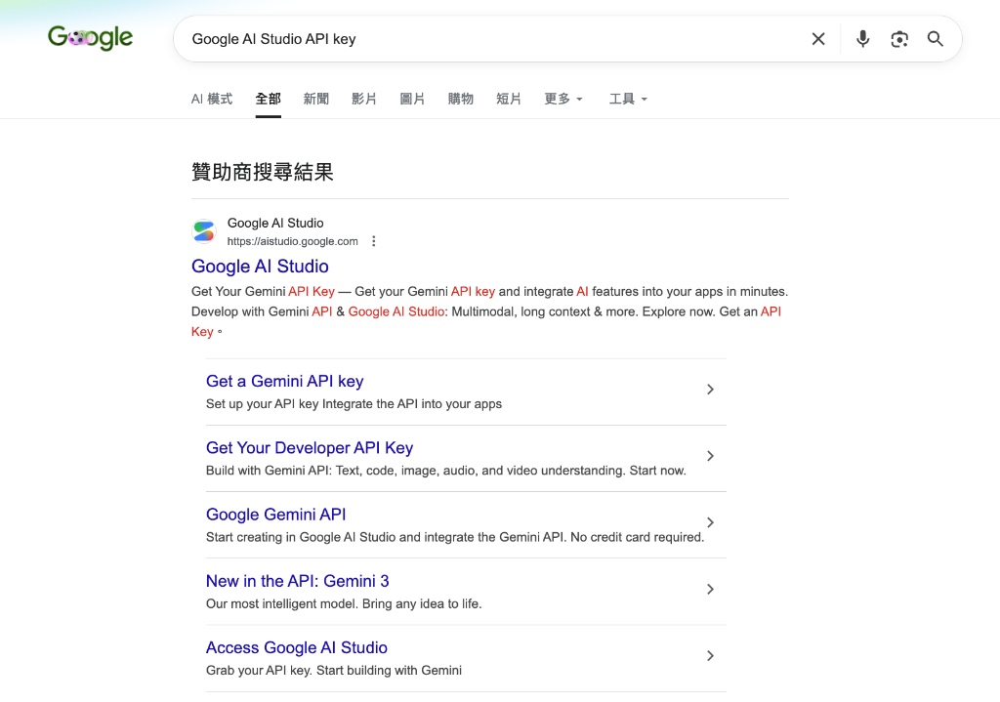
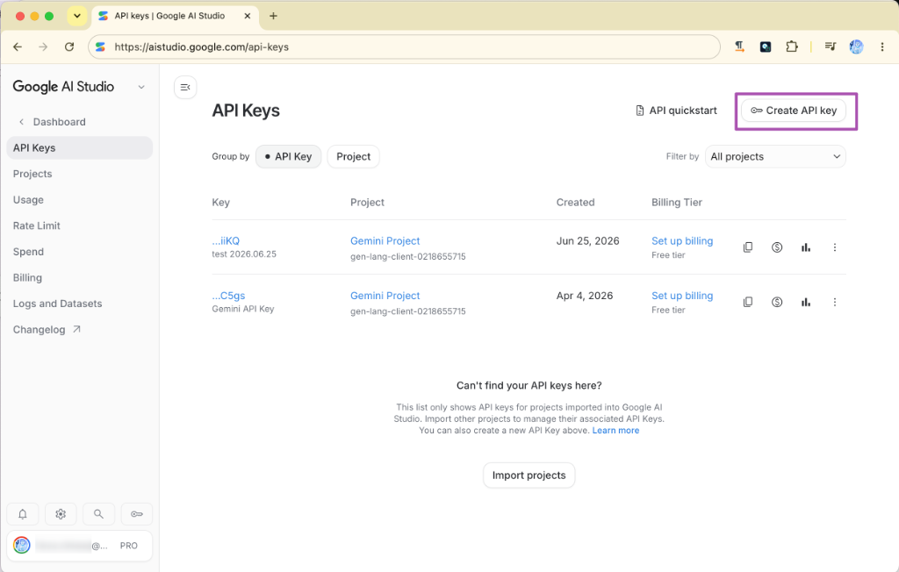
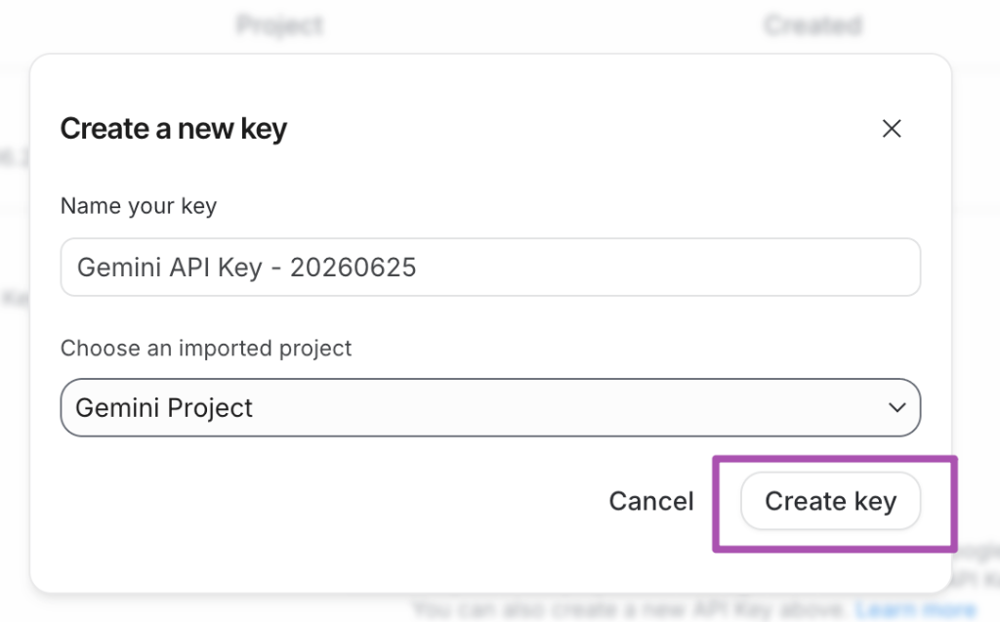
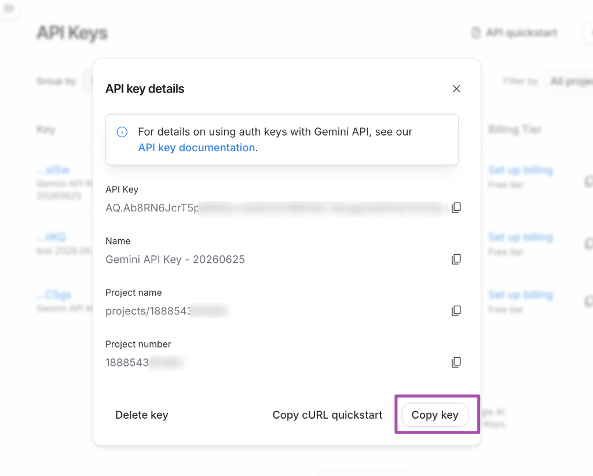
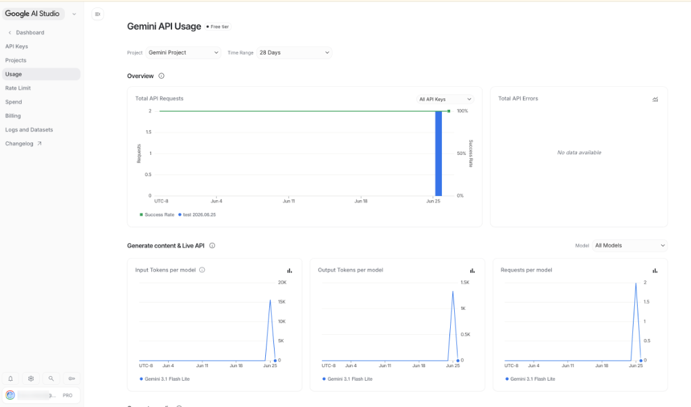

# 主題六：AI API 呼叫三大模式實戰

本主題旨在引導學員掌握當前主流的雲端、地端與瀏覽器原生三大 AI 呼叫技術<style>
/* 隱藏 HTML5 details 預設箭頭 */
details.prompt-details summary::-webkit-details-marker { display: none; }
details.prompt-details summary { list-style: none; }
/* 展開時旋轉自訂箭頭 */
details.prompt-details[open] summary span.arrow { transform: rotate(90deg); }
/* 懸停與點擊自訂過渡 */
details.prompt-details summary:hover { 
    background: rgba(56, 189, 248, 0.12) !important; 
    border-color: rgba(56, 189, 248, 0.4) !important; 
    color: #38bdf8 !important;
}
</style>

<div class="prompt-container" style="display: flex; flex-direction: column; gap: 1.5rem; margin: 1.5rem 0; padding: 1.5rem; background: rgba(30, 41, 59, 0.4); border: 1px solid rgba(255, 255, 255, 0.08); border-radius: 12px; backdrop-filter: blur(10px);">
    <div style="display: flex; flex-direction: column; gap: 0.5rem; margin-bottom: 0.5rem;">
        <h3 id="hardware-detection" style="margin: 0; color: #38bdf8; font-size: 1.25rem; display: flex; align-items: center; gap: 0.5rem; font-weight: 600; border: none; padding: 0;">🖥️ 互動式硬體檢測與 Ollama 選型（AI 助理專屬體驗）</h3>
        <p style="margin: 0; font-size: 0.9rem; color: #94a3b8; line-height: 1.5;">
            如果您正在使用支持環境感知與終端機執行權限的 AI 助理（如 Antigravity / Codex），可以直接一鍵複製下方任一提示詞並發送給 AI 助理。AI 助理將會自動在您的開發環境中執行系統安全檢測命令，掃描您當前的電腦硬體配置，為您量身打造最精準的 Ollama 本地模型選型與部署優化報告！
        </p>
    </div>

    <!-- 簡單版 Prompt 區塊 -->
    <div style="display: flex; flex-direction: column; gap: 0.75rem; background: rgba(15, 23, 42, 0.5); border: 1px solid rgba(255, 255, 255, 0.05); border-radius: 8px; padding: 1.25rem;">
        <div style="display: flex; justify-content: space-between; align-items: center; flex-wrap: wrap; gap: 0.75rem;">
            <h4 style="margin: 0; color: #10b981; font-size: 1.05rem; font-weight: 600; border: none; padding: 0;">
                🟢 1. 簡易檢測版 Prompt
            </h4>
            <button id="btn-simple-prompt" onclick="copyPrompt('simple')" style="background: #059669; color: white; border: none; padding: 0.4rem 0.8rem; border-radius: 6px; cursor: pointer; font-size: 0.8rem; font-weight: 500; display: flex; align-items: center; gap: 0.3rem; transition: all 0.2s ease;">
                <svg width="14" height="14" fill="none" stroke="currentColor" stroke-width="2" viewBox="0 0 24 24"><path d="M8 5H6a2 2 0 00-2 2v12a2 2 0 002 2h10a2 2 0 002-2v-1M8 5a2 2 0 002 2h2a2 2 0 002-2M8 5a2 2 0 012-2h2a2 2 0 012 2m0 0h2a2 2 0 012 2v3m-6 4h10m-5-5v10"></path></svg>
                複製「簡單版」提示詞
            </button>
        </div>
        <p style="margin: 0; font-size: 0.85rem; color: #cbd5e1; line-height: 1.4;">
            適合快速體驗。自動掃描硬體後，給出入門/中階/高階評級，並推薦最合適的 3B 及 7B 級別流暢模型與 Ollama 運行指令。
        </p>
        <details class="prompt-details" style="margin-top: 0.5rem; outline: none;">
            <summary style="font-size: 0.85rem; color: #94a3b8; cursor: pointer; user-select: none; padding: 0.5rem 0.75rem; background: rgba(255, 255, 255, 0.03); border: 1px dashed rgba(255, 255, 255, 0.15); border-radius: 6px; outline: none; display: flex; align-items: center; gap: 0.4rem; font-weight: 500; transition: all 0.2s ease;">
                <span class="arrow" style="transition: transform 0.2s ease; display: inline-block; font-size: 0.75rem;">▶</span> 點擊展開 / 折疊完整提示詞內容
            </summary>
            <pre id="simple-prompt-text" style="background: rgba(15, 23, 42, 0.8); border: 1px solid rgba(255, 255, 255, 0.05); border-radius: 6px; padding: 1rem; color: #e2e8f0; font-family: monospace; font-size: 0.85rem; white-space: pre-wrap; word-break: break-all; margin: 0.5rem 0 0 0; text-align: left; outline: none;"># 🤖 簡易本地 AI 算力檢測與 Ollama 選型

你現在是本地 AI 部署助手。請針對我提供的電腦規格，執行系統檢測命令（如果你具備執行權限）來自動獲取我的 CPU、GPU/VRAM、RAM、OS 和硬碟空間，或者請我手動提供。

獲取硬體規格後，請為我輸出：
1. **算力簡評**：我的電腦屬於入門體驗、中階實用還是高階流暢級？
2. **Ollama 模型選型推薦**：
   - 🟢 綠色流暢（&gt;30 tps）：最推薦運行的模型（如 llama3.2:3b）。
   - 🟡 黃色流暢（10-20 tps）：勉強可跑的模型。
   - 🔴 紅色警告（&lt;5 tps）：千萬別下的模型。
3. **一鍵部署指令**：對應的 `ollama run` 指令。</pre>
        </details>
    </div>

    <!-- 專家版 Prompt 區塊 -->
    <div style="display: flex; flex-direction: column; gap: 0.75rem; background: rgba(15, 23, 42, 0.5); border: 1px solid rgba(255, 255, 255, 0.05); border-radius: 8px; padding: 1.25rem;">
        <div style="display: flex; justify-content: space-between; align-items: center; flex-wrap: wrap; gap: 0.75rem;">
            <h4 style="margin: 0; color: #38bdf8; font-size: 1.05rem; font-weight: 600; border: none; padding: 0;">
                🛡️ 2. 深度診斷專家版 Prompt
            </h4>
            <button id="btn-expert-prompt" onclick="copyPrompt('expert')" style="background: #0284c7; color: white; border: none; padding: 0.4rem 0.8rem; border-radius: 6px; cursor: pointer; font-size: 0.8rem; font-weight: 500; display: flex; align-items: center; gap: 0.3rem; transition: all 0.2s ease;">
                <svg width="14" height="14" fill="none" stroke="currentColor" stroke-width="2" viewBox="0 0 24 24"><path d="M8 5H6a2 2 0 00-2 2v12a2 2 0 002 2h10a2 2 0 002-2v-1M8 5a2 2 0 002 2h2a2 2 0 002-2M8 5a2 2 0 012-2h2a2 2 0 012 2m0 0h2a2 2 0 012 2v3m-6 4h10m-5-5v10"></path></svg>
                複製「專家版」提示詞
            </button>
        </div>
        <p style="margin: 0; font-size: 0.85rem; color: #cbd5e1; line-height: 1.4;">
            適合企業部署評估。自動計算 VRAM 預算、系統記憶體頻寬瓶頸，並產出多模型選型矩陣、Context 增長壓力評估與 Ollama 性能極限調優腳本。
        </p>
        <details class="prompt-details" style="margin-top: 0.5rem; outline: none;">
            <summary style="font-size: 0.85rem; color: #94a3b8; cursor: pointer; user-select: none; padding: 0.5rem 0.75rem; background: rgba(255, 255, 255, 0.03); border: 1px dashed rgba(255, 255, 255, 0.15); border-radius: 6px; outline: none; display: flex; align-items: center; gap: 0.4rem; font-weight: 500; transition: all 0.2s ease;">
                <span class="arrow" style="transition: transform 0.2s ease; display: inline-block; font-size: 0.75rem;">▶</span> 點擊展開 / 折疊完整提示詞內容
            </summary>
            <pre id="expert-prompt-text" style="background: rgba(15, 23, 42, 0.8); border: 1px solid rgba(255, 255, 255, 0.05); border-radius: 6px; padding: 1rem; color: #e2e8f0; font-family: monospace; font-size: 0.85rem; white-space: pre-wrap; word-break: break-all; margin: 0.5rem 0 0 0; text-align: left; outline: none;"># 🛡️ 本地 AI 算力診斷與 Ollama 部署極限選型專家

你是一位頂尖的 AI 基礎架構架構師與本地 LLM 效能調優專家。請在我的本地開發環境中，依據以下工作流（Workflow）對我的電腦進行深度算力診斷，並產出一份企業級的本地 LLM 部署規劃書。

---

## ⚙️ 第一階段：環境感知與硬體掃描 (System Profiling)
請主動判斷我當前的作業系統環境（macOS / Windows / Linux），並執行或引導我執行對應的安全檢測指令，以獲取以下完整硬體數據。如果你具備終端機執行權限，請自主執行以下指令獲取數據：

- **macOS (Apple Silicon/Intel)**:
  `sysctl -n machdep.cpu.brand_string; echo "RAM:"; sysctl -n hw.memsize; echo "OS:"; sw_vers; echo "Disk:"; df -h /; echo "GPU/VRAM:"; system_profiler SPDisplaysDataType`
- **Windows (PowerShell)**:
  `Get-CimInstance Win32_Processor | Select-Object Name; Get-CimInstance Win32_PhysicalMemory | Measure-Object -Property Capacity -Sum | Select-Object Sum; Get-CimInstance Win32_VideoController | Select-Object Name, AdapterRAM; Get-Volume`
- **Linux**:
  `lscpu; free -h; df -h; lspci | grep -i vga`

---

## 📊 第二階段：多維度算力與限制評估 (Bottleneck Analysis)
獲取數據後，請進行以下精確計算與物理限制分析：
1. **可用顯存/統一記憶體預算 (VRAM Budget)**：計算扣除 OS 運作（Windows 預設扣 1.5GB，macOS 預設扣 3GB）後的「LLM 安全載入顯存上限」。
2. **記憶體頻寬與代償評估 (Memory Bandwidth & Offloading)**：評估若模型超出顯存，CPU 代償（Offloading）時的效能降幅。
3. **儲存介面評估**：確認剩餘空間是否足以容納目標模型，並說明磁碟剩餘空間的安全水位線（建議保留至少 10GB 空閒空間以防虛擬記憶體鎖死）。

---

## 🎯 第三階段：精準模型選型矩陣 (Model Selection Matrix)
請提供一個結構化的 Markdown 表格，針對以下主流開源模型，計算並推薦在我的硬體上運行的「最優量化精度 (Quantization)」與「預估推理速度 (tps)」：
- **模型對象**：Llama 3.2 (1B/3B), Qwen 2.5 (1.5B/3B/7B/14B), Gemma 2 (2B/9B), Llama 3 (8B)。
- **評估維度**：磁碟佔用(GB)、運行位置（VRAM/System RAM）、最優量化（如 Q4_K_M、Q8_0、FP16）、預估 Token 生成速度 (tokens/sec)、Context Window 安全上限（2K / 4K / 8K / 32K）。

---

## 💻 第四階段：輸出本地部署與優化藍圖 (Deployment Blueprint)
請依據上述評估，產出以下四個部分的專業報告：

### 1. 🎚️ 設備本地 AI 算力綜合評級
- [評級分類：入門體驗 / 中階實用 / 高階流暢 / 專業工作站，並指出核心硬體瓶頸。]

### 2. 🟢 推薦部署首選模型 (Highly Recommended)
- [列出 2 款在此設備上能達到 100% 顯存載入且推理速度 > 30 tps 的最優模型，附帶技術理由。]

### 3. 🛠️ 一鍵部署指令集 (Ollama Commands)
- [提供所推薦模型的安裝與運行指令，包括如何指定特定量化版本的 Tag（如 `qwen2.5:7b-instruct-q4_K_M`）。]

### 4. ⚡ 本地性能極限調優建議 (Performance Tuning)
- [提供 2-3 點針對該 OS 與硬體系統級優化參數。例如：環境變數 `OLLAMA_NUM_PARALLEL`（多用戶併發）、`OLLAMA_MAX_LOADED_MODELS`、以及如何透過限制執行緒數 `num_thread` 來優化 CPU 推理效能。]</pre>
        </details>
    </div>
</div>

<script>
function copyPrompt(type) {
    const textToCopy = document.getElementById(type + '-prompt-text').textContent;
    const buttonId = type === 'simple' ? 'btn-simple-prompt' : 'btn-expert-prompt';
    const originalText = type === 'simple' ? '複製「簡單版」提示詞' : '複製「專家版」提示詞';
    const successColor = '#059669';
    const originalColor = type === 'simple' ? '#059669' : '#0284c7';
    const btn = document.getElementById(buttonId);
    
    function showSuccess() {
        btn.style.background = successColor;
        btn.innerHTML = `<svg width="14" height="14" fill="none" stroke="currentColor" stroke-width="2" viewBox="0 0 24 24"><path d="M5 13l4 4L19 7"></path></svg> ✓ 已複製到剪貼簿`;
        
        setTimeout(() => {
            btn.style.background = originalColor;
            btn.innerHTML = `<svg width="14" height="14" fill="none" stroke="currentColor" stroke-width="2" viewBox="0 0 24 24"><path d="M8 5H6a2 2 0 00-2 2v12a2 2 0 002 2h10a2 2 0 002-2v-1M8 5a2 2 0 002 2h2a2 2 0 002-2M8 5a2 2 0 012-2h2a2 2 0 012 2m0 0h2a2 2 0 012 2v3m-6 4h10m-5-5v10"></path></svg> ` + originalText;
        }, 2000);
    }

    function fallbackCopy(text) {
        const textArea = document.createElement("textarea");
        textArea.value = text;
        textArea.style.position = "fixed";
        textArea.style.top = "0";
        textArea.style.left = "0";
        textArea.style.opacity = "0";
        document.body.appendChild(textArea);
        textArea.focus();
        textArea.select();
        try {
            const successful = document.execCommand('copy');
            if (!successful) {
                console.error('fallback copy failed');
            } else {
                showSuccess();
            }
        } catch (err) {
            console.error('fallback copy error: ', err);
        }
        document.body.removeChild(textArea);
    }

    if (navigator.clipboard && navigator.clipboard.writeText) {
        navigator.clipboard.writeText(textToCopy).then(showSuccess).catch(err => {
            console.warn('navigator.clipboard failed, trying fallback...', err);
            fallbackCopy(textToCopy);
        });
    } else {
        fallbackCopy(textToCopy);
    }
}
</script>

---

## 🚀 呼叫 AI 的三大運用模式：雲端、地端與瀏覽器原生 (Cloud vs Local vs Edge)

在進行 AI App 的實戰開發前，我們必須先掌握「如何呼叫 AI」的底層技術路徑。根據系統架構、資安防護、成本預算與運算延遲的不同， AI 呼叫主要分為以下三大經典模式。

### 1. 雲端 AI 呼叫：Google Gemini API (Cloud-based LLM) {#cloud-gemini}
*   **技術定位**：商業級雲端大模型 API。
*   **優勢**：模型推理解析力最強，支援超長上下文 (Context Window)，具備強大的多模態理解力，且完全免去本地硬體配置負擔。本範例推薦並採用 Google 最新一代主力模型 **Gemini 3.1 Flash-Lite** 與 **Gemini 3.5 Flash**。
*   **劣勢**：必須連接網際網路、有 API 調用成本 (按 Token 計費)、敏感數據直接送往雲端需注意隱私合規。

> [!IMPORTANT]
> **模型版本重要聲明**
> 請勿使用已停用或即將失效的舊版 **Gemini 1.5 系列 (如 gemini-1.5-flash)** 或較舊的 **Gemini 2.0 系列**，舊版模型在新版 API 通道中已無法正常運作或不具備最佳效能。本課程全面升級並推薦採用最新的黃金組合：
> 1. **`gemini-3.1-flash-lite`**：（推薦/最省用量）極速輕量化模型，回應延遲更低，Token 消耗成本極低，是高頻率查詢與 PoC 階段的首選。
> 2. **`gemini-3.5-flash`**：（推薦/高精度）高階深度審查模型，具備極佳的推理速度、代碼生成與多模態表現，最適合複雜邏輯、表格辨識與品管審查。

---

### 📊 企業級落地經濟學：新世代 Gemini 家族 (3.5 / 3.1 / 2.5) 模型選型與路由指引

在真實的企業級 AI 專案（如銀河 ERP 轉型或 AAA 憑證稽核）中，我們不可能盲目選用最貴的模型，否則 API 成本將會迅速吞噬產品利潤。這就引入了 **「落地經濟學 (Economics)」** 與 **「多模型級聯路由 (Cascade Routing)」** 的思維：在不同的處理階段、針對不同的任務難度，分流派遣最合適的模型廚師上陣。

#### 1. 新世代 Gemini 家族成員技術定位對比

| 模型名稱 | API 識別代碼 | 建議角色定位 | 適用場景與特色 |
| :--- | :--- | :--- | :--- |
| <span style="color: #0ea5e9; font-weight: bold;">⭐ Gemini 3.5 Flash (高階推薦)</span> | <span style="color: #0ea5e9; font-weight: bold;">`gemini-3.5-flash`</span> | <span style="color: #0ea5e9; font-weight: bold;">🛡️ 高階深度審查 (Stronger Review)</span> | <span style="color: #0ea5e9; font-weight: bold;">小字辨識、複雜表格、手寫辨識、或第一輪結果衝突時的終極裁決者。具備最強推理與 Agent 行為。</span> |
| **Gemini 3.1 Flash** | `gemini-3.1-flash` | ⚡ **主流主力模型 (Main Engine)** | 預設主力，具備極佳的代碼生成、邏輯推理與多模態表現，效能與速度最為平衡。 |
| <span style="color: #10b981; font-weight: bold;">⭐ Gemini 3.1 Flash-Lite (最省推薦)</span> | <span style="color: #10b981; font-weight: bold;">`gemini-3.1-flash-lite`</span> | <span style="color: #10b981; font-weight: bold;">💸 低成本快速草稿 (Low-cost Draft)</span> | <span style="color: #10b981; font-weight: bold;">高頻率調用、PoC 概念驗證、第一版文字或 JSON 結構草稿提取。速度極快，成本極低。</span> |
| **Gemini 2.5 Flash** | `gemini-2.5-flash` | 📊 **基準教學比較 (Baseline Comparison)** | 用於歷史基準對照、一般教學或簡單問答，作為效能升級前後的對比點。 |
| **Gemini 2.5 Flash-Lite** | `gemini-2.5-flash-lite` | ⏳ **歷史低成本基準 (Older Lite Baseline)** | 用於歷史版本的低成本基準對照。 |

#### 2. 企業級多模型雙通道路由 (Cascade Router) 設計實戰

在處理高精度 OCR 或自動化報表稽核時，生產環境通常會採取 **「雙通道級聯 (Cascade)」** 策略：

*   **預設雙模型通道 (教學展示 / 一般效能)**：
    *   **第一步 (Draft)**：`gemini-2.5-flash` (舊版基準，快速生成初始比對)
    *   **第二步 (Review)**：`gemini-3.1-flash-lite` (極速精修，以低成本過濾輕量級任務)
*   **強化雙模型通道 (高精度 / 生產環境實戰)**：
    *   **第一步 (Draft)**：`gemini-3.1-flash-lite` (快速打草稿，過濾 90% 簡單任務)
    *   **第二步 (Review)**：`gemini-3.5-flash` (對剩餘 10% 複雜表格與小字做終極審核，發揮最大推理潛能)

---

*   **💡 實戰指引：手把手申請與複製 Gemini API Key 步驟**：
    在呼叫 API 之前，學員必須先取得專屬的 API Key。請遵循以下 7 個步驟進行申請與確認：
    
    1. **步驟一：前往 Google AI Studio 官方入口**
       請在瀏覽器搜尋「Google AI Studio API key」，或直接點選訪問 [https://aistudio.google.com/api-keys](https://aistudio.google.com/api-keys)。
       
       
    2. **步驟二：點擊創建 API Key**
       進入後台的「API Keys」介面後，點擊右上角紫色的 **「Create API key」** 按鈕。
       
       
    3. **步驟三：輸入 Key 的名稱與專案**
       在彈出的視窗中，為您的 API Key 命名（例如：`Gemini API Key - 20260625`），並選擇或創建您的 Google Cloud 專案。
       
       
    4. **步驟四：確認生成金鑰**
       點擊彈出對話框右下角的 **「Create key」** 按鈕。
       
       
    5. **步驟五：複製並安全保存金鑰**
       生成成功後，會顯示您的專屬 API Key（`AQ...`），點擊右下角的 **「Copy key」** 按鈕即可複製。請將此 Key 妥善保存，切勿公開洩漏！
       
       
    6. **步驟六：隨時管理與確認付費級別**
       回到金鑰列表中，您可以看見已建立的金鑰。請確認其 **Billing Tier 為「Free tier (免費級別)」**。此處不需綁定信用卡，學員即可安心進行免費額度內的 API 測試。您隨時可以點擊列表中的「Copy key (複製圖示)」重新複製金鑰。
       
       
    7. **步驟七：觀測與監控 API 使用量與 Token 消耗**
       在 API Key 列表中，點擊金鑰右側紫色的 **「用量統計按鈕 (圖表圖示)」**。
       
       
       這會引導您進入 **「Gemini API Usage (用量統計頁面)」**。在此頁面中，您可以即時觀測 Total API Requests (請求次數)、Total API Errors (錯誤次數)，以及每個模型的 Input/Output Tokens 消耗趨勢。這對於我們實作 AI 專案時進行 **「落地經濟學 (Economics)」** 的 Token 成本控制與用量監控至關重要！
       

*   **實戰前端 JavaScript 呼叫代碼**：
```javascript
/**
 * ☁️ 雲端 AI: Google Gemini API 呼叫範例 (支援最新一代 3.5 / 3.1 / 2.5 家族)
 * 
 * 💡 技術特色（參考生產環境規格實戰設計）：
 * 1. 【安全金鑰傳遞】：捨棄在 URL 暴露 API Key，改以 HTTP Header 'x-goog-api-key' 傳送，避免金鑰殘留在瀏覽器歷史紀錄或 proxy log 中。
 * 2. 【結構化 JSON 回傳】：展示如何利用 generationConfig 強制要求 Gemini 輸出 100% 合規的 JSON 格式，便於前端直接解析渲染。
 * 3. 【多模型切換路由】：支援動態傳入不同世代模型，讓學員親身體驗各世代（3.5 vs 3.1 vs 2.5）在推理能力與回應速度上的差異。
 */
async function callGemini(promptText, apiKey, options = {}) {
  const { 
    // 💡 支援模型名單 (modelName):
    // - 'gemini-3.1-flash-lite' (💸 低成本快速草稿，預設/最省用量)
    // - 'gemini-3.5-flash'      (🛡️ 高階深度審查，推薦/高精度，最適合複雜邏輯與表格)
    // - 'gemini-3.1-flash'      (⚡ 主流主力模型，平衡效能與速度)
    // - 'gemini-2.5-flash'      (📊 歷史基準教學比較)
    // - 'gemini-2.5-flash-lite' (⏳ 歷史低成本基準)
    modelName = 'gemini-3.1-flash-lite', 
    responseJson = false           // 是否強制要求以 JSON 格式回傳
  } = options;

  // 建立符合 W3C 標準的 Gemini REST 端點 URL (支援動態傳入模型名稱)
  const url = `https://generativelanguage.googleapis.com/v1beta/models/${modelName}:generateContent`;
  
  const payload = {
    contents: [{
      parts: [{ text: promptText }]
    }],
    generationConfig: {}
  };

  // 💡 若指定 JSON 輸出，則透過 generationConfig 強制约束模型回傳 JSON 結構
  if (responseJson) {
    payload.generationConfig.responseMimeType = "application/json";
  }

  try {
    const response = await fetch(url, {
      method: 'POST',
      headers: {
        'Content-Type': 'application/json',
        'x-goog-api-key': apiKey // 🔑 安全傳遞：金鑰放於 Headers，比 query string 更安全
      },
      body: JSON.stringify(payload)
    });
    
    const data = await response.json();
    
    // 異常錯誤診斷與處理
    if (data.error) {
      throw new Error(data.error.message || "未知 API 錯誤");
    }
    
    // 從回傳結構中精準萃取文字
    const generatedText = data.candidates[0].content.parts[0].text;
    console.log(`[${modelName}] 原始輸出：\n`, generatedText);

    // 若指定 JSON 格式，則自動幫忙解析成 JS 物件
    if (responseJson) {
      try {
        return JSON.parse(generatedText);
      } catch (e) {
        console.warn("JSON 解析失敗，返回原始字串", e);
        return generatedText;
      }
    }
    
    return generatedText;
  } catch (error) {
    console.error(`Gemini (${modelName}) 呼叫失敗：`, error);
  }
}

// 💡 實測呼叫方式（學員可複製整段程式碼至瀏覽器 F12 Console 貼上運行）：
// 
// 1. 【極速低成本模式】 使用預設的 Gemini 3.1 Flash-Lite (最省用量)：
// callGemini("請用繁體中文解釋什麼是 RAG 技術？", "YOUR_GEMINI_API_KEY");
//
// 2. 【高階深度審查模式】 指定使用 Gemini 3.5 Flash 處理複雜精密任務：
// callGemini("請分析此程式碼的潛在記憶體洩漏風險：[在此貼上您的代碼]", "YOUR_GEMINI_API_KEY", { modelName: "gemini-3.5-flash" });
//
// 3. 【主流平衡模式】 指定使用 Gemini 3.1 Flash 平衡速度與能力：
// callGemini("請寫一首關於寫程式的五言絕句。", "YOUR_GEMINI_API_KEY", { modelName: "gemini-3.1-flash" });
//
// 4. 【歷史基準對照模式】 使用前代 Gemini 2.5 Flash 做對比測試：
// callGemini("什麼是落地經濟學？", "YOUR_GEMINI_API_KEY", { modelName: "gemini-2.5-flash" });
//
// 5. 【結構化 JSON 模式】 要求模型輸出特定 JSON 物件 (以 3.5 Flash 進行精密分析)：
// const jsonPrompt = `分析這封客戶信件的情感與急迫性。
// 信件內容：「我今天早上訂的系統到現在都無法登入，請立刻處理！」
// 請務必只回傳符合以下格式的 JSON 內容，不要包含額外文字：
// {
//   "sentiment": "正面/中立/負面",
//   "urgency": "高/中/低",
//   "summary": "一句話摘要"
// }`;
// callGemini(jsonPrompt, "YOUR_GEMINI_API_KEY", { responseJson: true });
```

---

### 2. 地端 AI 呼叫：Ollama 服務 (Local-based LLM) {#local-ollama}
*   **技術定位**：地端部署之開源模型伺服器。
*   **優勢**：100% 數據隱私安全（敏感商業資料完全不出企業內網）、零 Token 調用費用、可在無外網連線的物理隔離環境下穩定運作。
*   **劣勢**：極度依賴本地硬體算力（需要足夠的 GPU 顯示卡與視訊記憶體），且本地部署的模型參數規模其推理能力與雲端超大型模型相比仍有差距。

*   **💻 實戰指引：Mac M4 mini 16G 基準模型選型與避坑指南**：
    在本地運行 AI 模型時，主機記憶體大小是決定效能與穩定性的關鍵。
    本課程以 **Apple Mac mini (M4 晶片, 16GB 統一記憶體)** 作為教學與學員練習的基準硬體平台：
    *   **硬體優勢**：M4 晶片具備強大的 GPU 與 Neural Engine，統一記憶體架構（Unified Memory）能讓 GPU 以極高頻寬存取模型，運行速度極快。
    *   **記憶體避坑限制**：由於 M4 晶片的 16GB 記憶體必須由 macOS 系統、開發工具 (IDE)、瀏覽器與 Ollama 共用，**我們強烈建議地端模型參數規模控制在 8B 以下**。若勉強加載 12B 以上的模型，會導致記憶體不足而觸發虛擬記憶體交換 (Swap)，Token 輸出速率會從順暢的 40+ tps 斷崖式下跌至個位數。
    
    以下為我們針對 Mac M4 mini 16G 推薦的最佳 Ollama 模型組合：

    | 模型名稱 | Ollama 運行指令 | 模型類型與規模 | 記憶體佔用與效能評估 (16G 基準) | 適用企業場景 |
    | :--- | :--- | :--- | :--- | :--- |
    | **Gemma 4 (Effective 2B)** | `ollama run gemma4:e2b` | 文本 (Dense 2B) | 💾 極小 (約 1.6 GB)<br>⚡ 極速：~80+ tps | 本地極速文本分類、關鍵字提取、意圖偵測。完美留出系統開發空間。 |
    | **Gemma 4 (Effective 4B)** | `ollama run gemma4:e4b` | 文本 (Dense 4B) | 💾 較小 (約 2.8 GB)<br>⚡ 快速：~55+ tps | 中文語意理解極佳。適合本地離線對話、簡易合約分析、會議記錄摘要。 |
    | **Qwen 3 Vision-Language (2B)** | `ollama run qwen3-vl:2b` | 視覺多模態 (2B) | 💾 很小 (約 2.0 GB)<br>⚡ 快速：~60+ tps | **本地多模態/OCR 首選！** 支持直接傳入圖片進行發票辨識、考題解析，記憶體無負擔。 |
    | **Qwen 3 Vision-Language (8B)** | `ollama run qwen3-vl:8b` | 視覺多模態 (8B) | 💾 中等 (約 5.5 GB)<br>🚀 流暢：~35+ tps | 複雜表格與小字辨識。16G 記憶體的效能上限，建議運行時關閉其他重度程式。 |
    | **Qwen 3 (7B)** | `ollama run qwen3:7b` | 文本/代碼 (7B) | 💾 中等 (約 4.8 GB)<br>🚀 流暢：~40+ tps | 本地代碼輔助生成、複雜中文推理與 SQL 語法轉換。 |

*   **實戰前端 JavaScript 呼叫代碼**：
```javascript
// 🏠 地端 AI: Ollama 本地 API 呼叫範例 (支援最新 gemma4 與 qwen3-vl 視覺模型)
async function callOllama(promptText, modelName = 'gemma4:e4b', options = {}) {
  // 本地 Ollama 預設的生成端點
  // 💡 若為多模態視覺模型 (如 qwen3-vl)，Ollama 採用相同的 /api/generate 端點，但在 payload 中加入 images 陣列
  const url = 'http://localhost:11434/api/generate';
  const { images = [] } = options; // 支援傳入 Base64 圖片陣列 (不含 data:image/*;base64, 前綴)
  
  const payload = {
    model: modelName,
    prompt: promptText,
    stream: false // 💡 設定為 false 關閉串流，直接返回完整 JSON，便於前端解析
  };

  // 💡 多模態支援：若有圖片，則寫入 payload 中
  if (images && images.length > 0) {
    payload.images = images;
  }

  try {
    const response = await fetch(url, {
      method: 'POST',
      headers: {
        'Content-Type': 'application/json'
      },
      body: JSON.stringify(payload)
    });
    
    const data = await response.json();
    const generatedText = data.response;
    console.log(`[Ollama: ${modelName}] 輸出：\n`, generatedText);
    return generatedText;
  } catch (error) {
    console.error("Ollama 本地連線失敗，請確保本地 Ollama 已啟動且跨來源資源共用 (CORS) 已放行！\n錯誤資訊：", error);
    // 💡 避坑指引：若在前端網頁中直接 fetch 本地 API 遇到 CORS 阻擋
    // macOS/Linux 環境下請在啟動 Ollama 前，於終端機執行：export OLLAMA_ORIGINS="*"
    // Windows 環境下請在系統環境變數中新增 OLLAMA_ORIGINS 變數，值設定為 *，然後重啟 Ollama
  }
}

// 💡 實測呼叫（請先在終端機執行 ollama run 對應模型，並放行 CORS）：
// 
// 1. 【預設文本模式】 使用 Gemma 4 (4B) 進行本地問答：
// callOllama("請用繁體中文自我介紹。", "gemma4:e4b");
//
// 2. 【極速文本模式】 使用更輕量的 Gemma 4 (2B) 運行：
// callOllama("請寫一段 Python 氣泡排序法代碼。", "gemma4:e2b");
//
// 3. 【多模態視覺模式】 使用 Qwen 3 VL (2B) 進行圖片分析：
// // 傳入一張發票或題目的 base64 圖片 (此處省略 base64 字串)
// // callOllama("請辨識這張圖片中的發票號碼與總金額。", "qwen3-vl:2b", { images: ["iVBORw0KGgoAAAANSUhEUgAA..."] });
```

---

### 3. 瀏覽器原生 AI 呼叫：Chrome built-in AI (Edge-based LLM) {#chrome-nano}
*   **技術定位**：端側邊緣運算 (Edge AI)，大模型直接內嵌並運行於使用者的瀏覽器沙盒中。
*   **優勢**：真正的零伺服器運維成本、零網絡頻寬依賴（完全在使用者本地設備 CPU/NPU 運行）、極高隱私度，能大幅度減輕企業伺服器的算力負載。
*   **劣勢**：屬於極限輕量化模型（Gemini Nano 約 1.8B–3.2B 參數），僅適合進行簡易的文本摘要、翻譯、改寫、情感分析或意圖分類任務；目前僅限特定版本 Chrome 瀏覽器，且使用者需手動啟用實驗性 Flag。
*   **實戰前端 JavaScript 呼叫代碼**：
```javascript
// 🌐 瀏覽器原生 AI: Chrome built-in AI (Gemini Nano) 呼叫範例
async function callChromeNano(promptText) {
  // 1. 偵測瀏覽器是否支援且已啟用內建 AI API (W3C 草案標準)
  if (!window.ai || !window.ai.languageModel) {
    console.warn("當前瀏覽器不支援 Chrome 內建 AI。\n請確保使用的是 Chrome M127+，且已在 chrome://flags 啟用 'Built-in AI' 與 'Prompt API'。");
    return;
  }

  try {
    // 2. 檢查內建模型是否就緒與可用性
    const capabilities = await window.ai.languageModel.capabilities();
    if (capabilities.available === "no") {
      console.error("內建 Gemini Nano 模型尚未下載或無法在當前系統環境下使用。");
      return;
    }

    // 3. 建立 AI 會話 Session
    console.log("正在初始化 Chrome 內建 Gemini Nano Session...");
    const session = await window.ai.languageModel.create();

    // 4. 發送 Prompt 請求並取得回應 (非串流)
    console.log("發送 Prompt...");
    const response = await session.prompt(promptText);
    console.log("Chrome Nano 輸出：\n", response);
    
    // 5. 💡 避坑指引：使用完畢後務必摧毀 Session 以釋放瀏覽器記憶體
    session.destroy();
    return response;
  } catch (error) {
    console.error("Chrome Nano 執行失敗：", error);
  }
}

// 💡 實測呼叫：在符合條件的 Chrome 控制台直接執行
// callChromeNano("請將這句話翻譯成英文：今天天氣真好。");
```
